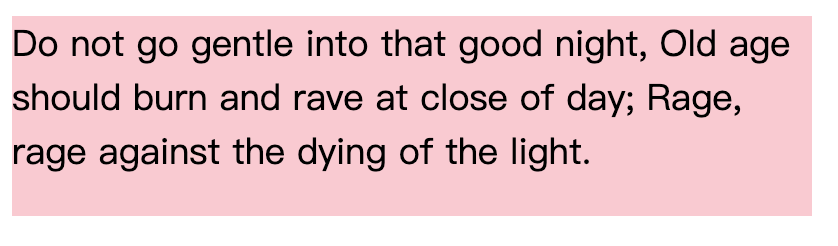

# CSS基础要点总结

## 1 CSS与文档

### 1.1 元素的分类

+ 根据元素的显示方式，CSS把元素分为块级和行内(内联)两种基本类型。
  - 常见的块级元素： div 	p
	- 常见的行内元素： a 	strong 	em 	span
	
+ 置换元素与非置换元素：置换元素指用来置换元素内容的部分不由文档内容直接表示。浏览器根据元素的标签和属性来决定元素的具体显示内容。HTML元素大部分是非置换元素。
	- 置换元素有：\ 、\<input> 、 \<textarea> 、 \<select> 等。
	- 非置换元素标签中的内容会直接表现给用户端（浏览器）。

#### 1.1.1 🐯[面试题] 块级元素、行内元素及行内块元素有什么区别？
+ 块级元素会独占一行，默认情况下，其宽度自动填满父元素宽度。
+ 行内元素不会独占一行，相邻的行内元素会排列在同一行，直到一行排不下，才会换行，其宽度随元素的内容而自适应地变化。
	- 行内元素设置宽高（width、height)无效
	- 对margin仅设置左右方向有效，上下无效；padding设置上下左右都有效，会撑大空间
	- 不会自动换行
+ 行内块元素综合了行内元素和块元素的特点，但各有取舍。
  - 不自动换行
  - 能识别宽高
-------
### 1.2 link标签与@import指令

+ link标签和@import指令都可以用来引入外部的css资源。
+ link属于html标签，@import指令来源于CSS。
+ link标签必须放在head元素中; @import声明必须放在所在样式表的开头。
+ 当一个页面被加载时（或者被浏览者浏览时），link引用的CSS会同时被加载，而@import引用的CSS会等到页面全部被下载完再被加载。所以有时候浏览@import加载CSS的页面时会没有样式（就是闪烁），网速慢的时候还挺明显。

--------
## 2 CSS选择器

### 2.1 类选择符和ID选择符

+ 类选择符：为设定了**class属性**的元素设定样式。

```HTML
<p class="success">
  操作成功
</p>
```

```css
.success{
  border: solid 1px green;
}
```

+ ID选择符：为设定了ID属性的元素设定样式。

```html
<div id="error">
  表单错误
</div>
```
```css
#error{
  border: solid 1px red
}
```

+ 类选择符和ID选择符对比：
	+ 类选择符可以赋予任意个数的元素，但在一个HTML文档中，一个ID能且只能使用一次。
	+ ID选择符的**权重更高**。

### 2.2 结构选择器

+ 根据HTML文档的元素层次结构选择元素，赋予样式。
| 选择器 | CSS引用方法 | 说明 |
| :--: |:--:|:--:|
| 后代选择器 |M  N|选择M元素内部的**所有N元素**|
| 子代选择器 |M>N|选择M元素内部的所有**第一级子代N元素**|
| 兄弟选择器 |M==~==N|选择M元素**后**所有的**同级N元素**|
| 相邻兄弟选择器 |M==+==N|选择M元素**相邻的下一个同级N元素**|

### 2.3 属性选择器

+ 根据元素的属性设置选择元素，赋予样式。
+ （1）**简单属性**选择
```css
/*给所有具有alt属性的img元素（图像）编写样式*/
img[alt]{
	border:2px solid red
}
```

+ （2）**精准的属性值**选择: 选择属性为特定值的元素
```css
a[href="http://www.css-discuss.org/about.html"]{
	font-weight:bold
}
```

> （3）* 根据部分属性值选择。

### 2.4 伪类选择器

+ 利用这种选择符可以为文档结构中**不一定真实存在的结构**指定样式，或者为某些元素（甚至文档本身）的**特定状态**赋予幽灵类。

+ 通常用`A:abc` 的形式来设置伪类。注意冒号前后并无层级递进关系，冒号后只是对冒号前的修饰限定。

+ （1）动态伪类选择器
```html
<a href="www.bilibili.com">哔哩哔哩动画</a>
<input>
```

```css
a:link{
  color:red;  /*默认样式 */
}
a:visited{
  color:yellow;  /*点击访问后的状态*/
}
a:hover{
  color:green;  /*鼠标悬浮后的状态*/
}	
a:active{ 
  color:black; /*鼠标点击后、松开前定义的状态*/
}
input:active{
  background:green;  /*输入框激活后的状态*/
}
input:focus {
  outline:none;  /*不要浏览器默认给的点击蓝色框线*/
}
```

+ （2）UI状态伪类 根据用户界面元素（一般为表单）的当前状态应用样式

```html
<form acrion="">
	<input type="text" disabled>
	<input type="text">
	<hr>
	<input type="radio" name="gender" id="boy">
		<label for="boy">男</label>
	<input type="radio" name="gender" checked id="girl">
		<label for="girl">女</label>
	<hr>
	<button>保存</button>
</form>
```
```css
input:diabled{
	background:red;/*禁止输入的表单元素*/
}
input:enabled{
	background:green;/*启用的表单元素*/
}
input:checked+label{
	/*选中的单选框，紧挨着的label元素*/
	color:lightgreen;
}
/*注意优先级*/
input:required{
	border:solid 1px red; /* 必填元素边框*/
}
input:optional{
	border:solid 1px blue /* 可选元素边框*/
}
```

+ （3）选择**空元素** **`:empty`** 伪类可以选择没有任何子代的元素，甚至连文本内容（文本空白）也没有

```html
<ul>
	<li>bilibili</li>
	<li></li>
</ul>
```
```css
li:empty{
	display:none;
}
```

+ （4）**:only-child**伪类选择唯一的子代。（所选择的子代必须是其直接父元素的唯一子代）

```css
img:only-child{
	border: 1px solid black;
}
```

+ （5）选择**第一个或最后一个某种**元素  :first-child 、 :last-child ； first-of-type、last-of-type

```html
<article>
  <h2>什么是js</h2>
	<h1>什么是CSS</h1>
	<aside>
		<h2>什么是html</h2>
	</aside>
  <h2>什么是前端开发？</h2>
</article>
```

```css
article:first-child{
  /*选择第一个子元素*/
	color:red;
}

article h1:first-of-type{
  /*选择第一个某种特定类型（h1）的子元素*/
  color:yellow;
}

article>h2:last-of-type{
  /*选择最后一个h2类型的子元素*/
  color:green;
}
```

+ （6）选择**唯一的子元素**  :only-child 、 :only-of-type

```css
/*html同上*/
article :only-child{
	/*选中了h1、aside*/
	font-size: 15px;
}

article>aside:only-of-type{
  /*选中唯一的aside类型*/
  background:purple;
}
```

+ (7)  根据元素编号选择  **:nth-child()** ,  括号内可写代数式，代数式an+b，n表示从0到无穷大的整数。
	+ 如果要从后往前计数，用**:nth-last-child()**
	+ 同理，**:nth-of-type() 和 :nth-last-of-type()** 可选择第n个某种元素

```css
article :nth-child(2){
	color:green; /*选择第一个子代*/
}
article :nth-child(3n+1){
	color:brown; /*选择第1、4、7、13......个子代*/
}
article :nth-child(-n+3){
  color:silver; /* 选择前三个子代*/
}
article :nth-child(odd){
	color:skyblue;/*选择奇数位元素*/
}
article :nth-child(even){
	color:skyblue;/*选择偶数位元素*/
}
```

+ （8）否定伪类 **:not()** 用来排除匹配

```css
ul li:nth-child(-n+3):not(:nth-child(2)){
	/*选择前三个li，但是排除第二个li*/
	color:orange;
}
```


### 2.5 伪元素选择器

> 伪类使用一个冒号, 伪元素使用**一对冒号**。但为了向后兼容，浏览器也接受使用单个冒号的伪元素选择符。
>
> 伪类和伪元素的根本区别在于：是否创造了逻辑上的新元素。伪元素可以创建新的虚拟的元素，但并不存在于DOM书中。伪类是为了弥补常规选择器的不足，将某种幽灵类应用到依附的元素上。

+ （1）装饰首字母 **::first-letter**、首行 **::first-line**

>  注意：目前 ::first-letter  和 ::first-line 只能应用到块级元素上，如标题、段落，而不能应用到行内元素上。

```css
p::first-letter{
	color:red; /*首字母红色*/
}
```
+  （2）**创建**或装饰**前置和后置**内容  **::before**	 **::after**
```css
h2::before{
	/*在h2元素内容前面加上一对金色的中括号*/
	content:"[]",
	color:gold;
}
```
-------
#### 2.5.1 [面试题]🐯 伪类选择器和伪元素选择器有什么区别？
+ 1. CSS3规定伪类格式 p:hover(一个冒号)，伪元素格式p::after(两个冒号)
+ 2. 伪类没有创建元素，但是伪类对应的元素真实的存在于dom树中；伪元素创建了新的逻辑上的元素，但是这个元素并不真实存在于dom树中。
+ 3. 伪类的效果可以通过添加一个类来达到，而伪元素的效果则需要通过添加一个元素才能达到，这也是为什么他们那一个称为伪类，一个称为伪元素的原因。

-------
## 3 CSS权重与优先级

### 3.1 指定样式冲突：权重计算

+ 所谓的指定样式，指的是指定”当前元素“的样式。当直接指定的样式（区别于继承而来的样式）发生冲突时，就需要计算权重。
| 选择器 |举例| 权重 |
| :--: |:--:|:--:|
| 通配符 |\*|0|
| 元素选择器、伪元素 |div	 ::before|1|
| class选择器、伪类 |.warning 	:active|10|
| 属性选择器 |[alt]|10|
| id选择器 |#para|100|
| ==行内样式== |style="..."|1000|
| !important 规则 |p {color:gray  !important}|∞|

### 3.2 综合考虑优先级：优先级不完全依赖于权重计算

+ 在CSS中，选择器权重计算只针对指定元素（当前元素），并**不能用于继承样式**。继承样式没有权重，（如果一定要用于权重对比，可以认为==继承而来的权重小于零==）。

+ 如果两个规则的权重、来源都相同，在样式表中后面定义的优先级更高。

+ 以"!important"标记的规则优先级最高。

```html
<article>
	<h2>我显示绿色,我有指定的样式，权重：1
		<span>我显示红色</span>
	</h2>
</article>
```

```css
*{
	color:red;
}
h2{
	color:green;
}
```

## 4   字体与文本

### 4.1 字体

+ 一般建议在==**font-family**==规则中指定**通用字体族**。这样做相当于提供一种后备机制，当用户代理找不到匹配的字体时，选择一个字体代替。

```css
h1 { font-family:Arial,sans-serif; }
```

+ @font-face 可以让我们在设计中使用自定义的字体。

```css
@font-face{
	font-family:"SwitzeraADF";
	src:url("SwitzeraADF-Regular.otf");
}
```

### 4.2 字重

+ CSS的==**font-weight**==属性可以精确控制字重（字体粗细）。
+ 数字100~900定义了9种量级的字体粗细。
+ 常用关键字**normal**对应数字400，bold对应数字700。
+ 关键字**bolder**和**lighter**分别是增大字重和减小字重的关键字。

### 4.3 字号

+ CSS的==**font-size**==属性可以精确控制字号。
> <span  style="border-bottom:2px dashed red;"> 我们可以使用=="font-size:0"==来去除inline-block（行内块元素）元素之间的间距。</span>

+ 可以用**像素值px**或**关键字**定义字号大小。关键字（small、medium、large等）定义的大小是相对的。

+ 关键字**larger**和**smaller**分别根据父元素的字号增大或减小一定的比例。

+ CSS还把长度单位**em**定义等效为百分数，对字号而言，1em与100%的效果相同。**响应式布局**经常使用单位em。1em等于元素的`font-size`属性值。

+ CSS中的字号会继承，但==继承的是计算得到的值==，而不是百分数本身。

#### 4.3.1 [面试题] 🚀em单位和rem单位有什么区别？
+ `em`和`rem`都是基于声明字号`font-size`的值的相对长度单位。`em`相对于当前元素的字号计算，而`rem`相对于根元素计算。根元素 html { fontsize:20px;}。

### 4.4 字形

+ **font-style**属性定义了字形：normal（常规）、italic（斜体）、oblique（倾斜体）。
+ 注意：斜体是一种单独的字形，各字母的构造有些改动，除了字符倾斜外，字符本身还可能会做调整。而倾斜体只是竖直体的倾斜版本。

### 4.6 大小写转换西文字母

+ **font-variant**描述符可以指定字型的变体。

```css
h2{
	/*转换成小型的大写字体（保持字号不变）*/
	font-variant:small-caps;
}
```

+ 也可以使用文本的方式转换大小写。

```css
h2{
	/* text-transform:capitalize;	*/ /*单词首字母大写*/
	/* text-transform:uppercase;  */ /*全大写*/
	text-transform:lowercase;				 /*全小写*/
}
```

### 4.5 组合简写

+ **font属性**可以把字体相关的属性（外加其他一些属性）合写在一起。
+ 通过**font属性**还可以设定**line-height**属性的值。方法是在font-size中增加一个值，中间用正斜线/分割。
+ **font**属性必须的两个值时`font-size`和`font-family`,而且必须以这样的顺序编写，其他值都是可选的。

```css
body{ font-size:12px; }
h2{ font: bold italic 200%/1.2 Verdana,Helvetica,Arial,sans-serif;}
/*这里h2元素的font-size值被设定为24px，line-heihgt值被设定为28.8px*/
```

### 4.6 文本装饰

+ **text-decoration**属性可以给元素文本添加下划线（underline），上划线（overline），删除线（line-through），文本闪烁（blink）。

```css
a{
	text-decoration:none;/*去掉超链接下划线*/
}
```

> 注意：text-decoration的值不能被继承。

### 4.7 文本阴影

+ **text-shadow**属性可以给文本加阴影。

```css
h2{
	text-shadow: rgba(150, 9, 238, .3) 5px 5px 1px;
	/*第一个参数指定颜色，第二个参数指定横向偏移量，第三个参数指定纵向偏移量，第四个参数可选，指定阴影的模糊半径*/
}
```

<div align="center">
  
</div>

-------
### 4.8  处理文本空白

+ **white-space**属性会影响用户代理对文档源码中空格、换行符合制表符的处理方式。
```css
p{
	white-space:normal;
	/*值为pre，表示空白不会被忽略*/
	/*值为nowrap，表示禁止换行*/
	/*值为pre-wrap，表示所有空白序列保留，正常换行*/
	/*值为pre-line，表示所有部分空白序列保留，换行的同时折叠行首空白*/
}
```
------

+ 实例：处理文本框文字溢出，以点号表示溢出内容。

```css
div{
	border:2px solid rgb(212, 21, 21);
	width:300px;
	font-size:24px;
	white-space:nowrap; 			/*禁止换行*/
	overflow:hidden;					/*超出部分隐藏*/
	text-overflow:ellipsis;   /*隐藏内容以... 显示*/
}
```

<div align="center">
  
</div>

### 4.9 处理文本缩进与对齐

####（1）文本缩进

+ 	==**text-indent**==属性可以控制首行文本缩进。

```css
div{
	font-size:24px;
	text-indent:2em; /*首行缩进两个字符*/
}
```

+ 🔥应用："text-indent:-9999px". 在搜索引擎优化**SEO**中，h1是非常重要的标签，一般情况下我们把网站的logo图片放到h1标签中，但是搜索引擎无法识别图片，只能识别文字，那就可以使用“text-indent：-9999px” 来隐藏h1的文字内容。

#### （2）文本横向对齐

+ ==**text-align**==属性控制当前块元素中各文本行的对齐方式。（沿行内方向对齐，一般是横向）
  - 左对齐表示各行左侧起始”x坐标”保持一致，右对齐表示各行右侧终止“x坐标”保持一致。

```css
div{
	border: solid 2px #eee;
	text-align:center;
	/*左对齐：left，右对齐：right，两端对齐：justify*/
}
```

> <span style="border-bottom: 2px dashed red;">注意：**text-align**属性只能用于块级元素，它只能用于控制元素中的内容的对齐方式，不能控制元素自身的对齐方式。</span>

#### （3） 🚀行的高度

+ 文本行的每个元素构成一个**内容区**，其高度由字体的高度决定，也就是说内容区的高度就是字体的高度。随内容区出现了**行内框**，如果不考虑其他因素，其高度与内容区高度完全一致。
+ 所有元素都有`line-height`值
+ 行高==**line-height**==指的是两行文字**基线**之间的距离，与字号无关。
+ 元素的**行距**等于font-size的计算结果减去line-height的计算结果。
+ 🐯<span style="border-bottom: 2px dashed red;font-weight:600">在CSS中，我们可以定义height和line-height这两个属性值相等，来实现单行文字的垂直居中。</span>
+ 当给元素直接设置的**line-height**为`em`、`ex`和百分数时，该元素`行高`的绝对值根据元素的`font-size`值来计算。
+ 当块级元素从父元素继承而来的line-height的值为**百分数或em、ex**时，，此时<span style="border-bottom: 2px dashed green;font-weight:600">行高根据父元素的字号计算</span>，而不是根据当前块元素的字号计算。

```css
/*注意行高指的是文字行间距*/
body{font-size:10px}
div{line-height:1em}/*行高(p元素中的文本）为10px，继承自body*/
p{font-size:18px}/*字号为18px*/
/*p的行高（继承自div）被限制死，然后p的字号比较大。这样会造成行纵向贴近*/
```
<div align="center">
  
</div>


+ 设定`行高`更好的方法是==**使用纯数字**==，即设定一个<span style="border-bottom: 2px solid red;">换算系数</span>。`行高`使用纯数字，<span style="border-bottom: 2px dashed green;font-weight:600">继承的将是设定的换算系数，各元素的行高将根据自身的字号计算</span>。（子元素继承的是父元素的换算系数而不是直接继承行高line-height）。

```css
body{font-size:10px}
div{line-height:1.5}/*行高（div文本行）为15px，行高系数1.5*/
p{font-size:18px}/*行高为（p元素文本行）27px，继承自div得到行高系数1.5*/
/*最终显示的文本行高是27px，（15px没有被继承）*/
```

```html
<article>
    <div>
      poems
      <p>Do not go gentle into that good night,
        Old age should burn and rave at close of day;
        Rage, rage against the dying of the light.</p>
    </div>
</article>
```
<div align="center">
  
</div>
+ 如果line-height的值设定为**inherit**，元素的行高将变成父元素行高的计算值。

####（4） 文本纵向对齐

+ ==**vertical-align**==属性只能用于**行内元素和置换元素**（如：图像和表单输入框），它不影响块级元素中文本的对齐方式。

|  |取值| 作用 |
| :--: |:--:|:--:|
| vertical-align |baseline|强制元素的基线与父元素的基线对齐|
| vertical-align |middle|把行内元素所在方框的中线相对父元素基线向上偏移0.5ex处的线对齐（1ex等于父元素的font-size）|
| vertical-align |top|把元素所在的行内框的顶边与行框的顶边对齐|
| vertical-align |bottom|把元素所在的行内框的底边与行框的底边对齐|
| vertical-align|sub|把元素放在下标处|
| vertical-align |super|把元素放在上标处|
| vertical-align|text-bottom|强制元素相对行中文本的底边对齐|
| vertical-align |text-top|强制元素相对行中文本的顶边对px|
| vertical-align|数值px|把元素抬升或下沉的指定距离（元素基线相对于父元素基线抬升或下沉）|
| vertical-align |百分数|把元素抬升或下沉指定距离，相对自身的line-height计算（元素基线相对于父元素基线抬升或下沉）|

#### （5）单词间距和字符间距

+ word-spacing ： 控制单词间距。可取任何长度值，关键字normal等同于0。
+ letter-spacing： 控制字符间距。可取任何长度值，关键字normal等同于0。

------

## 5 盒子模型

### 5.0 标准盒子模型与CSS3 怪异盒子模型
<div align="center">
  <p style="font-weight:700">常规盒子模型</p>
  
</div>

+ 当我们给一个div设置宽高为500px,实际上设置的是content部分的宽高，如果此时再设置padding，border，整个div的宽高会往外增大。
+ CSS3提出了新的盒子模型，通过**`box-sizing:border-box`**属性，此时给div设置宽高500px，宽高会自动加上`padding`和`border`的值, 属于content部分的宽高将不足500px。
### 5.1 垂直外边距合并

+ 当两个**垂直外边距**相遇时，这两个外边距会合并成一个外边距，这种合并外边距的方式被称为**折叠**。
  - 两个相邻的外边距都都是正数时，折叠结果是它们两者之间的较大值。
  - 两个相邻的外边距都是负数时，折叠结果是两者绝对值的较大值。
  - 两个外边距一正一负时，折叠结果是两者之和。
+ 外边距叠加的三种情况：
	+ 同级元素：当一个元素出现在另一个元素上面的时候，第一个元素的下边距将会和第二个元素的上边距发生合并。
	+ 父子元素：当一个元素在另外一个元素中时（父子嵌套），<span style="border-bottom: 2px solid purple;font-weight:400">假如没有内边距padding或边框border把外边距分隔开的话</span>，父元素和子元素的相邻上下边距也会发生合并。
	+ 空元素：当一个空元素有上下外边距时，如果没有border或者padding，则元素的上外边距与下外边距会发生合并。

#### 5.1.1 如何避免垂直外边距折叠
+ <span id="marginCollapse">使用**BFC（块级格式化上下文）**来避免外边距折叠</span>。
  - 相邻块级盒子（同级）之间的垂直外边距只有在它们处于同一个BFC时才会发生折叠。如果它们属于不同的BFC，就不会发生外边距折叠了。所以，通过创建新的BFC我们可以避免外边距折叠。
```html
<style>
.container {
  background-color: red;
  /* 创建块级格式化上下文 */
  overflow: hidden;
}
p {
  margin: 10px 0;
  background-color: lightgreen;
}
.newBFC {
   /* 创建新的块级格式化上下文 */
  overflow: hidden;
}
</style>
<body>
  <div class="container">
    <p>Sibling1</p>
    <p>Sibling2</p>
    <!--Sibling2 和 Sibling3之间的垂直外边距并没有折叠！ -->
    <div class="newBFC">
        <p>Sibling3</p>
    </div>
  </div>
</body>
```
<div align="center">
  
</div>
------
### 5.2 负外边距

+ 对于**普通文档流**元素：
	+ 当元素的`margin-top`或`margin-left`为负数时，“当前元素”会被拉向指定方向。
	+ 当元素的`margin-bottom`或`margin-right`为负数时，“后续元素”会被拉向指定方向。

+ 对于**浮动**元素：
	+ 关注浮动元素的“流动方向”。
------

#### 😁 <span style="border: 2px dashed blue;">负margin的使用技巧：</span>

+ 图片与文字对齐：实现图片与文字底部垂直对齐。

```html
<div>
	 百度logo
</div>
```

```css
img{
	margin: 0 3px -3px 0;
}
```

<div align="center">
  
</div>


+ **自适应两列布局**：一列宽度自适应，另一列宽度固定。

```html
<div id="content">
  <p>content:主体内容部分,宽度自适应。</p>
</div>
<div id="sidebar">
  <p>这是侧边栏部分，固定宽度</p>
</div>
```

```css
#content,
#sidebar {
  float: left;
  color: white;
}
#content {
  width: 100%;
  /*利用负margin，把后续sidebar元素拉入同行。实现自身宽度自适应*/
  margin-right: -200px;
  background-color: red;
}
#sidebar {
  width: 200px;
  background-color: purple;
}
#content p {
  margin-right: 210px;
}
```

<div align="center">
  
</div>


+ 实现块元素垂直居中。

```html
<div id="father">
  <div id="son"></div>
</div>
```

```css
#father {
   position: relative;
   width: 400px;
   height: 320px;
   border: 2px dashed gray;
}
#son {
   position: absolute;
   top: 50%;
   left: 50%;
   /*向上偏50%高，向左偏50%宽*/
   margin-top: -60px;
   margin-left: -100px;
   width: 200px;
   height: 120px;
   background-color: red;
}
```

<div align="center">
  
</div>

> + tab选项卡：使用margin-top:-1px来解决选项卡下边框的显示问题。

------

### 5.3 内边距、外边距的百分数值

+ <span style="border-bottom:2px solid red"> 对于生成块级框的元素，如果设定元素的内边距为百分数值，那么==百分数值相对**父元素内容区的宽度**计算==。这一点不仅针对左右内边距，还针对上下内边距。</span>

> 定位元素，弹性布局中的元素和栅格布局中的元素，其上下内边距的百分数值多数时候相对格式化上下文的高度计算。

+ 与内边距一样，外边距百分数值也是相对父元素的内容区宽度计算，因此外边距的具体值将随父元素的宽度而改变。

### 5.4 行内非置换元素的内边距

+ 应用到行内非置换元素上的内边距对行高没有任何影响。
>  但是如果非置换元素有背景色和内边距，其背景会向元素上下延伸。

+ 给行内非置换元素设定左右内边距确实能看到效果。

### 5.5 置换元素的内边距

+ 不管置换元素是块级（inline-block？）还是行内（如input、label等）内边距都会出现在内容四周。而且背景色会填充到内边距区域。
+ 行内置换元素的内边距对行高有影响。

### 5.6 圆角的使用

+ 元素边框角默认是直角。可以使用**border-radius**属性定义一个或多个圆角半径。与其他简写属性一样，最多可以根据顺序为border-radius提供四个值。
+ 如果值取百分数，单个圆角将不一定为圆形，因为圆角的侧边的百分比会和圆角侧边所在的直角边长度关联。这样，如果为一个有长短边的矩形框设置百分数border-radius，那么将得到椭圆形角。
+ 可以为单独的圆角指定属性。如border-top-left-radius、boder-bottom-right-radius。

### 5.7 轮廓线的使用

+ CSS定义了一种特殊的装饰方式，名为**轮廓（outline）**。
+ 轮廓线不占空间，对布局完全没有影响，只是视觉上的效果。
+ 轮廓线可以不是矩形.
+ 通常，用户代理在元素处于focus状态时渲染轮廓线。
+ 轮廓线无法单独为一边设置独特的轮廓。
+ 可以定义轮廓式样（outline-style）、轮廓颜色（outline-color）、轮廓宽度（outline-width）。总的简写属性：outline
+ 常用outline:none 来去掉浏览器默认给表单提供的蓝色轮廓线。

```css
input{
	outline:none;
}
```

### 5.8 display属性 与 visibility属性

+ display:none 、 display：block 控制元素的隐藏、显示。
+ display:inline 、display:block、display:inline-block  控制块元素、行内元素、行内块元素切换。

+ visibility:hidden  隐藏元素。等同于（opacity:0）

+ #### <span style="border: 2px dashed blue;"> 🐯visibility:hidden 与display:none 控制元素隐藏有什么区别？</span>
	+ display:none隐藏元素会影响文档流，隐藏当前元素，后续元素会占据当前元素的位置。
	+ visibility:hidden 隐藏元素就只是隐藏元素，不影响文档流。


### 5.9 box-sizing属性

+ 默认情况下，块级框的width等于左内边界到右内边界的距离，height等于上内边界到下内边界的距离。但是这两个属性可以根据box-sizing属性调整。
+ **`box-sizing:border-box`** ~ width表示从元素左边框的外边界到右边框的外边界之间的距离。边框宽度，内边距宽度和内容区宽度都将计算在width之内。height同理。

### 5.10 overflow溢出隐藏

| 取值 | 使用效果 |
| :--: |:--:|
| overflow:visible |超出元素框的内容正常显示|
| overflow:hidden |超出元素框的内容隐藏|
| ==overflow:scroll== |超出元素框的内容隐藏，浏览器会产生滚动条|
| overflow:auto |让用户代理自己决定使用哪种行为|

### 5.11 尺寸控制：最值宽度和高度

+ 根据内容的量或尺寸灵活选取给定的min-width、max-width、min-height、max-height。

### 5.12 其他技巧

+ fill-available 自动撑满可用空间.
+ fit-content 根据内容自适应尺寸。

```css
main{
	width:100vw;
	height:100px;
	background:#9b59b6;
}
div{
	background:#f1c40f;
	margin:auto;
	/*宽度根据内容自适应*/
	width:fit-content;
	padding:10px;
}
```

```html
<main>
	<div>www.google.com</div>
</main>
```

+ max-content和min-content 根据内容尺寸自适应。

```css
main{
	width:max-content;
	background:purple;
	margin:auto;
	margin-top:30px;
}

div{
	background:yellow;
	padding:10px;
	margin-bottom:20px;
}
```

```html
<main>			
  <div>www.google.com|www.google.com|www.google.com|www.google.com|www.google.com|www.google.com</div>
	<div>www.google.com</div>
</main>
```

------

## 6 背景与渐变

### 6.1 背景

| 属性取值 | 使用效果 |
| :--: |:--:|
| **background** |以下内容的简写方式|
| **background-color** |控制背景颜色|
| **background-image** : url() |放入背景图片，可以用逗号连接多个url()来设置多个背景|
| **background-clip** : border-box、padding-box、content-box |控制背景延伸到何处|
| **background-position** : left、center、 right、top、bottom|背景图片定位|
| **background-repeat** : no-reapeat、space |背景图片不重复、平均分配【默认重复】|
| **background-attachment** : fixed、scorll|背景图片禁止滚动、允许滚动|
| **background-size** : cover、contain|背景图片填满内容区，常用于大图背景自适应/保证背景图完全显示，可以留白|

+ 盒子阴影**box-shadow**
```css
div{
	box-shadow:10px 10px 10px rgba(100,100,100,.5)
}
```

### 6.2 渐变

+ 渐变主要分为**线性渐变和径向渐变**。

+ 线性渐变：
	+ 线性渐变指沿线性向量填充得到的渐变。

```css
#ex01{background-image:linear-gradient(purple,gold);}
#ex02{background-image:linear-gradient(90deg,purple,gold);}
#ex03{background-image:linear-gradient(to bottom left,purple,gold);}
/*设置中色点,在(25%-75%）之间过渡渐变*/
#ex04{background-image:linear-gradient(to right,#000 25%,rgb(90%,90%,90%) 75%)}
/*循环线性渐变*/
#ex05{background:repeating-linear-gradient(-45deg,black 0,black 25px,yellow 25px,yellow 50px) top left;}
```

+ 径向渐变：
	+ 径向渐变可以实现圆形或椭圆形在径向方向上的颜色渐变。

```css
	/*css中没有声明形状，除方形元素之外都是椭圆形；在方形元素中，形状为圆形*/
	#ex06{background-image:radial-gradient(purple,gold);}
	/*css中指定一个非负长度值，得到圆形渐变*/
	#ex07{background-image:radial-gradient(50px,purple,gold);}
	/*css中指定两个非负长度值，得到椭圆形渐变*/
	#ex08{background-image:radial-gradient(50px,100px,purple,gold);}
	/*使用关键词指定中心位置*/
	#ex09{background-image:radial-gradient(at bottom left,purple,gold)}
	/*利用中色点，画一个小太阳,(先声明一个方形盒子）*/
	#ex10{background-image:radial-gradient(red,yellow 30%,black 70%,black 100%)}
	/*设置过渡中间点(红到绿中间点定位到几何尺寸的40%处）*/
	#ex11{background-image:radial-gradient(90deg,red,40%,green)}
	/*循环线性渐变(先把宽高设为200px）*/
	#ex12{background-image:repeating-radial-gradient(100px,100px,red,yellow 25px,red 60px);}
```

## 7 CSS表格与列表

+ **border-collapse** 可以设置单元格之间边框的模式。取值collapse使用折叠边框。取值separate，使用分离边框。

+ **list-style-type**可以设置列表项目的记号类型。如果不显示记号，应该使用none值。

## 8 🚀浮动float

+ 使用css可以浮动任何元素。在css中，浮动通过属性“float”来实现。
+ 浮动的元素脱离了常规的文档流，不过对布局仍有影响。因为元素浮动后，其他内容都将围绕它“流动”。
> 什么是正常（普通）文档流？什么是脱离文档流？
> + 正常文档流，将一个页面从上到下分为一行一行，其中块元素独占一行，相邻行内元素在每一行中按照从左到右排列直到改行排满。
> + 对元素使用了**浮动或定位**会后，就会脱离文档流。

+ 如果浮动了非置换元素，要为元素设定宽度。
+ <span style="border: 2px dashed blue;"> **float属性**：（left，right，none）</span>：分别表示脱离文档流向左浮动、脱离文档流向右浮动、默认初始值（不浮动）。
+ 不管元素是什么类型，**浮动后得到的都是块级框**。比如一个行内元素span浮动后，要为其设置宽高。
+ 浮动元素与其他元素的内容重叠问题：
	+ 行内框与浮动元素重叠时，其边框、背景和内容都在浮动元素“之上”渲染。
	+ 块级框与浮动元素重叠时，其边框和背景都在浮动元素“背后”渲染，而内容在浮动元素“之上”渲染。

### 8.1 🚀清除浮动


#### (1) 使用clear属性清除浮动

+ 浮动对兄弟元素的影响
	+ 由于设置了浮动的元素脱离了正常文档流，将影响后续的文档流。但是我们并不想让后续内容向浮动元素的一方流动，因此需要清除浮动。

+  <span style="border: 2px dashed blue;"> **clear属性**：（left，right，none，both）</span>
	+ clear:left  ~ 确保当前元素的左边远离先前被设置了浮动的元素。
	+ clear:both ~ 确保当前元素不与任何浮动的元素共处一行。

```html
<main>
  <div class="red"></div>
  <div class="blue"></div>
</main>
```
```css
/*【案例：使用clear:left 清除浮动】*/
div { 
   width: 200px;
   height: 150px;
}
div.red {
  float: left;
  border: solid 2px red;
}
div.blue {
  /* 确保blue的左边远离浮动元素（red） */
  clear: left;
  background: blue;
}
```

<div align="left">
  
</div>


#### (2) 清除浮动有哪些方案？

> 浮动元素对父元素的影响：
>
> 如果浮动元素的高度height大于父元素的高度height，或者父元素没有定义高度height，此时浮动元素会脱离父元素。即**父元素高度塌陷**。

+ **额外标签法**清除浮动：
	+ 原理：只让浮动在父盒子内部生效。

```html
<main>
  <div class="red"></div>
  <div class="green"></div>
  <p class="clearfix"></p>
</main>
```

```css
main {
    /* 父盒子main未定义高度 */
		/* 清除浮动后避免了父盒子的高度塌陷*/
    border: 1px dashed black;
}

div {
  width: 200px;
  height: 150px;
}
div.red {
   float: left;
   border: solid 2px red;
}
div.green {
   float: right;
   background-color: green;
}

p.clearfix {
  /* 确保p元素不与任何浮动的元素共处一行*/
   clear: both;
}
```

<div align="center">
  
</div>

+ 使用升级版的额外标签法~ **::after 伪元素**创建额外标签。

```html
<main class="clearfix">
  <div class="red"></div>
  <div class="green"></div>
</main>
```

```css
main {
  border: 2px dashed black;
}
div {
  width: 200px;
  height: 150px;
}
div.red {
  float: left;
  border: solid 2px red;
}
div.green {
  float: right;
  background-color: green;
}
/*伪元素*/
.clearfix::after {
  clear: both;
  content: 'hahaha';
  display: block;
}
```

+ 实际开发中使用::after伪元素清除浮动的方法（兼容低版本IE)

```css
.clearfix{*zoom:1;} /*解决IE6、7的浮动问题*/
.clearfix::after{
		clear:both;
		content:'';
		display:block;
		height:0;  /**/
		visibility:hidden;/**/
}
```

+ <span id="clearFloat">利用overflow触发**BFC清除浮动**：给浮动元素的父元素添加一个属性`overflow:hidden`创建了一个BFC</span>。

```css
main {
    border: 2px dashed black;
    width: 500px;
    margin: 0 auto;
    padding: 20px;
    /*清除浮动：创建了一个BFC*/
    overflow: hidden;
}
div {
   width: 200px;
   height: 150px;
}
div.red {
   float: left;
   border: solid 2px red;
}
div.green {
   float: right;
   background-color: green;
}
```

```html
<main class="clearfix">
  <div class="red"></div>
  <div class="green"></div>
</main>
```
------
### 8.2 浮动形状 CSS shapes

#### 8.2.1 定义形状  **shape-outside**

+ 若想规定浮动元素周围的内容按什么形状流动，首相要定义一个形状。使用**shape-outside**属性。
+ 使用图像定义浮动形状：shape-outside:url(...)
> 如果图像有透明部分，例如是GF87a,或者PNG格式，那么内容将流入透明的部分。内容将流入与之“直接接触”的那一侧的透明部分。

+ 使用 inset() 、 circle () 、ellipse()  、 polygon() 分别定义带尺度和定位的基本形状（内凹、圆、椭圆、多边形）。

+ 使用margin-box 、 border-box 、padding-box、content-box 指明形状最外边的界限，可以单独使用（形状框）。
+ 形状框和基本形状可以组合使用。
+ 无论如何，（基本形状定义的）形状都不会超出形状框，溢出形状框的部分将会被形状框裁剪。


#### 8.2.2  以透明度定义浮动形状

+ **shape-image-threshold** 允许图像中不完全透明的部分流入内容。即指定透明度为多少时允许内容流入。
> shape-image-threshold:0.5 图像中透明度超过50%的部分将允许内容流入。

#### 8.2.3 为形状额外添加外边距

+ 定义好浮动形状后，可以使用**shape-margin**属性为形状添加”外边距“，这个”外边距“可以把内容推开一定长度或百分比距离。


-------


## 9 定位position

### 9.1   基本概念

+ 容纳块：容纳块是指包含另一个元素的框体。对于定位元素，容纳块完全取决于定位类型。
	+ 对非根元素来说，如果position的属性的值是relative或static，其容纳块由最近的块级、单元格或行内块级祖辈元素框体的内容边界划定。
	+ 对非根元素来说，如果position的属性的值时absolute，其<span style="color:red;font-weight:600">容纳块</span>是**position属性的值不是static的最近的祖辈元素**（任何类型），这也是**子绝父相**的由来。
+ 偏移属性：当`position`的属性值不为`static`时，使用四个属性（top，right，bottom，left）来指定定位元素的各边相对容纳块的偏移。这四个属性称为偏移属性。这些属性指定了距**容纳块**最近的边的偏移。
+ 偏移属性的值可以是百分数，上下偏移量相对容纳块的高度计算，左右偏移量相对容纳块的宽度计算。
> 例如，top属性指定了定位元素的**上外边距边界**距容纳块的顶边有多远。

+ 使用width或height可以为定位元素指定具体的宽度和高度。
+ 元素的内容区尺寸可以使用`min-width`和`min-height`定义最小值，使用`max-width`和`max-height`定义最大值。

### 9.2 相对定位relative

+ 相对定位使用偏移属性移动元素。相对定位的”相对“指的是**相对元素自身在常规流中的位置**来定义元素的位置。
+ 相对定位的元素没有脱离文档流，相对定位会使元素提升一个层级。
+ 相对定位不会改变元素的性质，块还是块，内联还是内联。

```css
p {
    border: solid 5px blueviolet;
    width: 400px;
    height: 400px;
    padding: 30px;
}

p img {
    width: 50px;
    /*相对定位*/
    position: relative;
    top: 200px;
}
```

```html
<p>
   
   Lorem ipsum dolor sit amet, consectetur adipisicing elit. Eligendi, velit reprehenderit voluptate saepe cum
   veritatis expedita dignissimos illum placeat eum obcaecati doloribus provident, exercitationem quisquam!
</p>
```

<div align="center">
  
</div>

+ 注意：图像原本所在的位置出现了空白。这是因为在相对定位中，元素从常规的位置移开了，但是其占据的空间并没有消失。相对定位的元素偏移后可能与其他元素重叠。

------

### 9.3 绝对定位

+ **绝对定位的元素完全脱离文档流**，其位置相对容纳块而定，外边距的边界使用偏移属性划定。
+ 绝对定位的元素不会围绕其他元素的内容流动，其内容也不围绕定位元素流动。

```css
p {
  border: solid 5px blueviolet;
  width: 400px;
  height: 200px;
  padding: 30px;
}

p img {
  width: 50px;
  /*绝对定位*/
  position: absolute;
  top: 100px;
}
```
<div align="center">
  
</div>

------
+ <span style="background-color:yellow">绝对定位的元素的容纳块是position属性的值不是static的最近的祖辈元素</span>。<span style="border-bottom:2px dashed blue;">子元素绝对定位使用的偏移量基于容纳块（父元素）。习惯上，当选定了绝对定位元素的容纳块元素后，会把容纳块的`position`的值设为`relative`，而且不设置偏移</span>。（子绝父相）

> 绝对定位的元素时相对于离他最近的开起了定位的祖先元素进行定位的。

```css
p {
	/*父级：相对定位*/
  position: relative;
  border: solid 5px blueviolet;
  width: 400px;
  height: 200px;
  padding: 30px;
}

p img {
  width: 50px;
  /*子级绝对定位*/
  position: absolute;
  top: 0;
  right: 0;
}
```

<div align="center">
  
</div>

------

+ 【绝对定位案例】: 使用绝对定位定位一个图标。

```html
<ul>
   <li>
     <span>AMD</span>
     
   </li>
</ul>
```

```css
* {
  padding: 0;
  margin: 0;
}

body {
  padding: 80px;
}

ul {
  list-style: none;
}

ul li {
  width: 300px;
  border: solid 6px blueviolet;
  overflow: hidden;
  position: relative;
}

ul li img {
  width: 100%;
  float: left;
}

ul li>span {
  /* 绝对定位 */
  position: absolute;
  width: 50px;
  height: 30px;
  background: red;
  color: white;
  font-size: 18px;
  text-align: center;
  line-height: 30px;
  border-radius: 5px;
  left: 20px;
  top: 20px;
}
```

<div align="center">
  
</div>


------

### 9.4 固定定位 position:fixed

+ 固定定位定位元素的**容纳块是视区**。设为固定定位的元素完全脱离文档流，意味着**和父级不再有”继承“关系**。

+ 【固定定位案例：固定顶栏菜单】

```html
<body>
  <header></header>
  <main></main>
</body>
```
```css
* {
  padding: 0;
  margin: 0;
}

header {
  position: fixed;
  left: 0;
  top: 0;
  right: 0;
  height: 60px;
  border-bottom: solid 5px blueviolet;
  box-shadow: 0 5px 10px #555;
  background-color: white;
  z-index: 10;
}

main {
  /* 这里position:relative 覆盖了header，所以把header 的z-index加大 */
  position: relative;
  height: 3000px;
  background: red;
  /* margin-top: 100px; */
}
```

------

### 9.5 粘滞定位

+ position:sticky
+ 参考使用场景：音乐app，查找艺人。

+ 【粘滞定位案例】

```html
<main>
    <article>
      <section>
        <h2>www.bilibili.com</h2>
        <p>Lorem ipsum dolor sit amet consectetur adipisicing elit. Eaque incidunt earum ipsam soluta eius reprehenderit
          voluptatum at non adipisci. Ipsum.</p>
      </section>
      <section>
        <h2>www.bilibili.com</h2>
        <p>Lorem ipsum dolor sit amet consectetur adipisicing elit. Eaque incidunt earum ipsam soluta eius reprehenderit
          voluptatum at non adipisci. Ipsum.</p>
      </section>
      <section>
        <h2>www.bilibili.com</h2>
        <p>Lorem ipsum dolor sit amet consectetur adipisicing elit. Eaque incidunt earum ipsam soluta eius reprehenderit
          voluptatum at non adipisci. Ipsum.</p>
      </section>
    </article>
  </main>
```

```css
* {
  padding: 0;
  margin: 0;
}

body {
  padding-left: 100px;
  padding-top: 100px;
}

article {
  width: 400px;
  height: 200px;
  border: solid 5px blueviolet;
  overflow: scroll;
}

article section {
  padding-bottom: 50px;
}

article section:nth-of-type(even) h2 {
  background-color: #333;
}

article section h2 {
  background-color: blueviolet;
  color: white;
  /* 粘滞定位 */
  position: sticky;
  top: 0px;
}
```

------
### 9.6 控制元素居中定位的几种方式


+ 绝对定位元素居中时，计算top、left的偏移量，根据父级width、height（减去padding）减去当前元素的width、height再除以2得到。


```html
<article>
  <div></div>
</article>
```
```css
article {
  border: solid 4px blueviolet;
  width: 600px;
  height: 600px;
  margin: 50px;
  position: relative;
}

div {
  background: blue;
  width: 200px;
  height: 200px;
  position: absolute;
  /*直接计算: 父元素宽度*0.5-当前元素宽度*0.5*/
  left: 200px;
  /*直接计算: 父元素高度*0.5-当前元素高度*0.5*/
  top: 200px;
}
```

+ 配合使用**负外边距**计算。
```css
article {
  border: solid 4px blueviolet;
  width: 600px;
  height: 600px;
  margin: 50px;
  position: relative;
}

div {
  background: blue;
  width: 200px;
  height: 200px;
  position: absolute;
  /*left和top偏移属性指定的是外边距边界距【容纳块】的相应边界的距离*/
  left: 50%;
  top: 50%;
  /*配合负外边距*/
  margin-left: -100px;
  margin-top: -100px;
}
```

```html
<article>
  <div></div>
</article>
```
------
###  9.7 滚动对定位元素的影响

```css
article {
  border: solid 4px blueviolet;
  width: 600px;
  height: 600px;
  margin: 50px;
  position: relative;
  overflow: scroll;
}

section {
  height: 3000px;
  background: #bbb;
}

div {
  background: blue;
  width: 200px;
  height: 200px;
  position: absolute;
  left: 0;
  bottom: 0;
}
```

```html
<article>
  <section>
    <div></div>
  </section>
</article>
```
<div align="center">

</div>
> 此时内容会跟随滚动条滚动。
------
### 9.8 比较浮动与定位
+ 1. 对元素同时使用postion和float属性，无论谁写在前面，都是position先起作用：
  - 当position为absolute、fixed时，元素已脱离文档流，再对元素使用float失效。
  - 当position为static、relative时，元素依旧处于普通文档流，再对元素使用float会起作用。
+ 2. 试比较定位和浮动两种脱离文档流机制的区别？
  - 用position定位使元素脱离文档流后，**该元素不占据空间**，用`top、bottom、left、right`决定位置。
  - 用float是元素脱离文档流后，**该元素占据空间**，用margin，padding等决定和周围内容的距离。
------

## 10 弹性盒模型

+ 通过弹性盒（Flexbox）可以轻松控制元素的排列对齐和元素的视觉顺序。使用弹性盒模型可以让元素在不同尺寸终端控制尺寸。

+ 弹性盒依赖父子关系。在元素上声明`display: flex` 或 display：inline-flex 便可激活弹性盒布局，这个父元素随之称为弹性容器，负责在所占的空间内布置子元素。弹性容器的子元素称之为弹性元素。

+ 把一个元素设置为弹性容器后，只有直接子元素使用弹性盒布局，其他后代元素不受影响。

+ 主轴：指定了元素流动的方向。
+ 垂轴：允许换行的前提下，新弹性元素行的堆叠方向。
> 每一行的弹性元素沿主轴方向排布，从主轴起边流向主轴终边，但是额外的行沿垂轴方向排布，从垂轴起边流向垂轴终边。垂轴与主轴始终垂直。

+ 弹性元素的外边距不折叠，float和clear属性对弹性元素不在起作用，不会把弹性元素移出文档流。应用到弹性元素上的float属性和clear属性将被忽略。
+ 绝对定位的弹性元素，与绝对定位普通元素一样，将从普通文档流中移除。

### 10.1 弹性容器


| 属性 | 取值 |使用效果 |
| :--: |:--:|:--:|
| **flex-direction** |row、row-reverse、column、column-reverse|定义弹性容器的**主轴**，弹性元素按照主轴排布|
| **flex-wrap** |wrap、==nowrap==、wrap-reverse|是否允许弹性元素**换行**、后续行的位置|
| **==flex-flow==**|<flex-direction\><flex-wrap\>|方向和换行的集中**简写**形式|
| **justify-content**|flex-start、flex-end、center、space-between（首尾元素贴起边、终边）、space-around（余下空间均分给弹性元素）、space-evenly（余下空间按间距均匀拆分）|指明在弹性容器的**主轴上如何分布**各行里的弹性元素|
| **align-items**|flex-start、flex-end、==center==、baseline、stretch|定义弹性元素在**垂轴方向上的对齐**方式（垂轴起边、终边、中线...)|
| **align-content** |flex-start、flex-end、center、space-between（首尾元素贴垂轴起边、终边）、space-around（余下空间均分给弹性元素）、space-evenly（余下空间按间距均匀拆分）、stretch（余下空间均匀分给各弹性元素并拉伸各行尺寸）|定义弹性容器有额外的空间时，在**垂轴方向上**如何对齐各弹性元素的**行**|


### 10.2 弹性元素

| 属性 | 取值 |使用效果 |
| :--: |:--:|:--:|
| **flex** |0、 1、 auto|是flex-grow（弹性增长因子）、flex-shrink（弹性缩减因子）、flex-basis（弹性元素的初始尺寸）的集中简写形式。如果flex只有一个值，而且是正数，那个值将用作增长因子，而缩减因子默认为0，基准也默认为0。|
| **align-self** |auto、flex-start、flex-end、center、baseline、stretch|改变某个或某些弹性元素的垂轴对齐方式|
| **order** |-1、0、1...|修改单个弹性元素的显示顺序，默认情况下，所有弹性元素的顺序都是0，order属性为负数的弹性元素显示在默认值0的弹性元素前面，order属性为正的弹性元素显示在采用默认值0的弹性元素后面|

## 11 栅格系统

### 11.1 栅格基础

+ 声明栅格系统容器：**display:grid** 或 **display:inline-grid**。

+ 同弹性盒模型类似，**栅格容器**为其中的内容定义了一个栅格格式化上下文。栅格容器的子元素是**栅格元素**。

+ 栅格容器不是块级容器，二者区别如下：
	+ 浮动的元素不会打乱栅格容器。
	+ 栅格容器的外边距不与其后代的外边距折叠。

+ 有些css属性不能运用到栅格容器和栅格元素上。

+ **栅格轨道**指两条相邻的栅格线之间夹住的整个区域。
+ **栅格单元**指四条栅格线限定的区域，内部没有其他栅格线贯穿，类似于单元格。
+ **栅格区域**指任何四条栅格线限定的矩形区域，由一个或多个栅格单元构成。   

### 11.2 放置栅格线

+ 栅格布局中的一切都依赖于栅格线。**grid-template-rows**和**grid-template-columns**分别可以用来绘制**行栅格线**和**列栅格线**。

+ 栅格线划分针对是栅格容器的宽和高。行栅格线划分容器高度，列栅格线划分容器宽度。

```css
#grid{
	display:grid;
	grid-template-columns:200px 50% 100px;
	/*建立了四条列栅格线，依据给定的尺度划分栅格容器的宽度*/
}
```

+ 栅格线始终可以使用数字引用。栅格线没有默认名称。在CSS中，可以使用数字引用栅格线，也可以使用为其指定的名称，又或者二者混用。

+ **给栅格线命名**：把想用的名称放在值中的恰当位置，并在两侧加上**方括号**。

```css
#grid {
	display:grid;
	grid-template-columns:[start col-a] 200px [col-b] 50% [col-c] 	100px [stop end last]
	/*分别给四条列栅格线命名*/
}
```

+ 栅格线并不一定全在栅格容器内。为了避免栅格线超出栅格容器，在设置栅格线的同时可以为行栅格线或列栅格线设定极值，指明行的高度（或列的宽度）不能小于一个值，也不能大于一个值，让浏览器计算具体的值。方法是**minmax（a,b)**

```css
#grid{
		display:grid;
		grid-template-columns:[start col-a] 200px [col-b] 50% [col-c] 100px [stop end last];
		grid-template-rows:[start masthead] 3em [content] minmax(3em,100%) [footer] 2em [stop end];
}
```


### 11.3 弹性栅格系统

+ 弹性栅格系统的尺寸基于弹性容器中非弹性轨道以外的空间确定，或者基于整个轨道中的具体内容而定。
+ 如果想把余下的空间分成一定份数，分配给各栏，可以使用**fr**单位。

```css
#grid{
	display:grid;
	grid-template-columns:15em 1fr 10%;
}
/*中间的栅格横向空间弹性伸缩。*/
```

```css
#grid{
	display:grid;
	grid-template-columns:15em 4.5fr minmax(5em,3fr) 10%;
	/*指定第三列的最小宽度为5em*/
}
```

+ 根据内容设定轨道的尺寸。min-content（尽量少占据空间，够显示内容即可） 和max-content（占据内容所需的最大空间）。


### 11.4 重复栅格线

+ **repeat()** 可以重复创建栅格线。

```css
#grid{
	display:grid;
	grid-template-columns:repeat(3,2em 1fr 1fr)
}
/*重复三次列结果2em-1fr-1fr*/
```

+ auto-fill  可以自动填充。

### 11.5 使用*栏距*控制间隔

+ row-gap和column-gap分别用于控制行栏之间的间距和列栏之间的间距。
+ 使用简写属性**grid-gap**可以把行和列的栏距合并在一起设定。


### 11.6 使用栅格线编号、偏移量放置元素

+ 将某一元素与栅格线限定的区域做关联。**grid-row-start、grid-row-end、grid-column-start、gird-column-end**  。

```css
.one{
	/*栅格线编号*/
	grid-row-start:2; grid-row-end:4;
	grid-column-start:2;grid-column-end:4;
}
.two{
	/*span后面有数字，意思是”跨指定数目的栅格轨道。向确定了编号的栅格线的反方向计数*/
	grid-row-start:2; grid-row-end:span 2;
	grid-column-start:2;grid-column-end:4;
}
.three{
	/*引用栅格线不只限于使用编号，如果栅格线有名称，还可以使用名称引用栅格线*/
	grid-row-start:R 2; grid-row-end:span 2;
	grid-column-start:col-B;grid-column-end:4;
}
```

### 11.7 行和列的简写

+ 简写属性**grid-row、gird-column** 能简化把元素附加到栅格线上的过程。

+ 在以**斜线**分割的两部分中，前一部分定义的是开始栅格线，后一部分定义的是结束栅格线。
	+ 如果值中没有斜线，那么定义的是开始栅格线，结束栅格线取决于开始栅格线的值。
	+ 如果只提供一个数字，那么第二个数字（即结束线的编号）被设为auto。
```css
#grid{
	display:grid;
	grid-template-rows:repeat(10,[R] 1.5em);
	grid-template-columns:2em repeat(5,[col-A] 5em [col-B] 5em) 2em;
}
.one{
	gird-row:R 3 / 7;
	grid-column:col-B / span 2;
}
```

### 11.8 绘制栅格区域

+ **grid-template-areas** 通过集中命名栅格元素来控制栅格区域.每个标识符表示一个栅格单元。知道各单元的标识符后，浏览器会把名称相同的相邻单元合并为一个区域。不过得到的形状必须是矩形。

```css
#grid{
display:grid;
grid-template-areas:
	"h h h h"
	"l c c r"
	"l f f f"
}
```


+ 定义具名栅格区域时，将创建名为-start和-end形式的栅格线。对名为footer的栅格区域来说，顶边和左边两条栅格线的名称是footer-start，底边和右边两条栅格线的名称是footer-end。

### 11.9 引用栅格区域：grid-area

+ **grid-area**只用一个属性引用栅格区域。先设置一些具名栅格区域，定义布局，然后通过grid-area把栅格元素放入指定的区域。

```css
#grid{
display:grid;
grid-template-areas:
	"h h h h"
	"l c c r"
	"l f f f"
}
.one{
	gria-area:h;
}
```

### 11.10 栅格流

+ 如果不指明栅格元素的位置，栅格元素将自动放入栅格中。在**栅格流**的作用下，栅格元素将放在第一个适合它的区域中。栅格流通过属性**grid-auto-flow**属性设置。

+ 栅格流主要分为两种模式：行优先（默认）grid-auto-flow：row，列优先 grid-auto-flow：column。

+ 如果想让栅格元素尽量靠紧，而不管顺序会受到什么影响，就需要在grid-auto-flow的属性值里加上关键字**dense**。

### 11.11 栅格对齐方式

+ 栅格布局的对齐方式和弹性盒类似。

+ justify-\* 属性改变的是**行内轴**上的对齐方式。
+ align-\* 属性改变的是**块级轴**上的对齐方式。


| 属性 | 对齐目标 |适用于 |
| :--: |:--:|:--:|
| **justify-self** |**行内轴**上的单个栅格元素在自己的栅格区域中的对齐方式|栅格元素|
| **justify-items** |**行内轴**上的全部栅格元素在各自栅格区域中的对齐方式|栅格容器|
| **justify-content** |**行内轴**上的整个栅格在容器中的对齐方式|栅格容器|
| **align-self** |**块级轴**上的单个栅格元素在自己的栅格区域中的对齐方式|栅格元素|
| **align-items** |**块级轴**上的全部栅格元素在各自栅格区域中的对齐方式|栅格容器|
| **align-content** |**块级轴**上的整个栅格在容器中的对齐方式|栅格容器|
| **order** |-1、0、1...|修改单个重叠的栅格元素的显示顺序，默认0,正在后，负在前|
| **z-index** |-1、0、1...|修改单个重叠的栅格元素的显示顺序，正值近，负值远|


## 12 【总结】居中的实现方案
> 详细参考: [搞定居中](https://blog.csdn.net/weixin_37219302/article/details/80504236?utm_medium=distribute.pc_relevant_download.none-task-blog-2~default~BlogCommendFromBaidu~default-12.nonecase&dist_request_id=1332049.676.16193608639629451&depth_1-utm_source=distribute.pc_relevant_download.none-task-blog-2~default~BlogCommendFromBaidu~default-12.nonecas)
### 12.1 水平居中

#### 12.1.1 常规元素（普通文档流中元素）的水平居中

+ 行内元素、不定宽的块级元素，给父元素设置`text-align:center`
```css
.outer{
  text-align:center;
}
```
```html
<div class="outer">
  <div class="inner">
    我是水平居中的不定宽的块级元素
  </div>
  <span>我是要水平居中的行内元素,下面的图片也是要居中的行内元素</span>
  
</div>
```

> 注意：水平居中的对象如果是一行文字，“text-align:center” 这个属性可以加到父级元素上，或文字所在的元素本身上。

+ 居中定宽的块级元素 ， 给当前块级元素设置`margin:0 auto`。
```css
#inner{
  width:200px;
  margin:0 auto;
}
```
```html
<div class="outer">
  <div class="inner">
    我是要水平居中的定宽块级元素
  </div>
</div>
```

+ 通用方法，父元素使用`diaplay:flex`弹性盒模型。 不管是普通文档流中的行内元素还是块元素，通杀。
```css
.outer {
   display: flex;
   justify-content: center;
}
```
```html
<div class="outer">
    <div class="inner">
      我是要居中的元素
    </div>
</div>
```

------

#### 12.1.2 浮动元素的水平居中

> 元素浮动之后，本身相当于设置了display:inline-block; 可以设置宽高了，没有行级和块级之分。只有定宽和不定宽之分。

+ 定宽的浮动元素居中：给浮动元素设置相对定位，同时使用`left` 和负外边距`margin-left`让浮动元素水平居中。
```css
.inner{
  position:relative;
  left:50%;
  /*负外边距使用：宽度width的一半的负值*/
  margin-left:-100px;
}
```
```html
<div class="outer" style="width:500px;height:80px;background-color:pink;">
  <div class="inner" style="float:left;width:200px;background-color:aqua;">
    我是要水平居中的浮动、定宽元素
  </div>
</div>
```

+ 不定宽元素

```css
.outer {
  position: relative;
  width:600px;  /*方便看效果*/
  height: 50px; /*撑开父元素高度，方便看效果*/
}

.inner {
  position: absolute;
  left: 50%;
  transform: translateX(-50%);
}
```
```html
<div class="outer" style="background-color:green;border:3px solid red">
  <span class="inner" style="float:left;background-color:pink;">
      我是不定宽的浮动元素，我要水平居中
  </span>
</div>
```
<div align="left">
  
</div>
+ 通用（定宽不定宽都适用）`display:flex`
```css
.outer {
  display: flex;
  justify-content: center;
}
```

```html
<div class="outer">
  <span class="inner" style="float:left;width:200px;">我是要居中的浮动元素</span>
</div>
```

------

#### 12.1.3 绝对定位元素的水平居中

> 绝对定位元素后，元素脱离普通文档流，相当于设置了display:inline-block, 可以设置宽高了。决定定位的元素，也没有行级和块级之分，只有定宽和不定宽之分。

+ 宽度固定的绝对定位元素

```css
/*【写法1：】*/
.outer{
  /*相对于父元素的水平居中*/
  position:relative;
}
.inner {
   left: 50%;
   margin-left: -100px;/*此处的负值是自身宽度的一半*/
}
/*-----------------------------*/
/*【写法2：】*/
.outer{
  position:relative;
}
.inner{
  left:0;
  right:0;
  margin:0 auto;
}
```

```html
<div class="outer" style="width:400px;height:100px;background-color:pink;">
    <div class="inner" style="position:absolute;width:200px;background-color:aqua;">
      我是要居中的定宽的绝对定位元素
    </div>
</div>
```

<div align="left">
  
</div>
+ 不定宽的绝对定位元素:( 利用CSS3新特性。存在兼容性 )
```css
.outer {
  position: relative;
}
.inner {
  left: 50%;
  transform: translateX(-50%);
}
```

```html
<div class="outer" style="background-color:pink;width:400px;height:100px;">
  <div class="inner" style="position:absolute;background-color:aqua;">
    我是要居中的不定宽的定位元素
  </div>
</div>
```
<div align="left">
  
</div>

+ 通用方式：不管是否定宽，通杀flex弹性盒模型。
```css
.outer {
  display: flex;
  justify-content: center;
}
```
```html
<div class="outer" style="background-color:pink;width:400px;height:100px;">
  <div class="inner" style="position:absolute;background-color:aqua;">
   使用弹性盒模型水平居中定位元素
  </div>
</div>
```

#### 12.1.4 总结：水平居中的通用方式~弹性盒布局

```css
.outer{
  display:flex;
  justify-content:center;
}
```

```html
<div class="outer">
  <div class="inner">
    我是要居中的常规、浮动、绝对定位元素。此办法均适用于IE10以上版本的浏览器。
  </div> 
</div>
```


------

### 12.2 垂直居中

> 垂直居中，默认外部元素（这里称父元素）都是有高度的

#### 12.2.1 常规元素的垂直居中

+ 行内文本元素: line-height = height

```css
.inner {
  line-height: 60px;
}
```
```html
<div class="outer" style="height:60px;background-color:pink;">
  <span class="inner">我是要垂直居中的行内文本</span>
</div>
```
<div align="left">
  
</div>

+ 通用（不管行内、块级、图片，都通杀）

```css
.outer{
  display:flex;
  align-items:center;
}
```
```html
<div class="outer" style="height:100px;background-color:pink;">
  <div class="inner">
    我是要垂直居中的元素
  </div>
</div>
```

#### 12.2.2  浮动元素的垂直居中

+ 给**高度固定的**绝对定位元素设置`bottom:0,top:0`， 并设置`margin:auto 0`。
```css
.outer {
  position: relative;
}

.inner {
  /*绝对定位会覆盖浮动*/
  position: absolute;
  top: 0;
  bottom: 0;
  margin: auto 0;
}
```

```html
<div class="outer" style="height:200px;background-color:pink;">
  <div class="inner" style="float:left;height:100px;background-color:aqua;line-height:100px;">
    我是要垂直居中的定高浮动元素
  </div>
</div>
```

<div align="left">
  
</div>

+ 给绝对定位元素设置`top:50%`，然后<span style="border-bottom:2px solid green">将绝对定位的元素向上偏移自身高度的一半</span>。
```css
.outer{
  position:relative;
}
.inner{
  position:absolute;
  top:50%;
  /*  1. 高度固定：负值取自身高度的一半*/
  margin-top:-30px;
  /*  2. 高度不固定，有兼容性问题
  transform: translateY(-50%);
  */
}
```

```html
<div class="outer" style="height:200px;background-color:pink">
  <div class="inner" style="float:left;height:60px;background-color:aqua;line-height:60px;">
    我是要垂直居中的浮动元素
  </div>
</div>
```

+ 通用垂直居中：flex
```css
.outer{
  display:flex;
  align-items:center;
}
```
```html
<div class="outer" style="height:200px;background-color:pink">
  <div class="inner" style="float:left;height:60px;background-color:aqua;line-height:60px;">
    我是要垂直居中的浮动元素
  </div>
</div>
```

#### 12.2.3 绝对定位元素的垂直居中

+ 给**高度固定的**绝对定位元素设置`bottom:0,top:0`， 并设置`margin:auto 0`。
```css
.outer {
  position: relative;
}

.inner {
  bottom: 0;
  top: 0;
  margin: auto 0;
}
```
```html
<div class="outer" style="height:120px;background-color:pink">
  <div class="inner" style="background-color:aqua;height:60px;position:absolute;line-height:60px;">
    我是要垂直居中的绝对定位元素
  </div>
</div>
```
<div align="left">
  
</div>

+ 给绝对定位元素设置`top:50%`，然后<span style="border-bottom:2px solid green">将绝对定位的元素向上偏移自身高度的一半</span>。

```css
.outer {
  position: relative;
}
.inner {
  top: 50%;
  /*1. 高度固定*/
  margin-top: -30px;
  /*  2. 高度不固定，有兼容性问题
  transform: translateY(-50%);
  */
}
```
```html
<div class="outer" style="background-color:pink;height:120px;weight:300px;">
  <div class="inner" style="position:absolute;background-color: aquamarine;height:60px;width:120px;">
  </div>
</div>
```
+ 通用：利用flex布局 
```css
.outer {
  display: flex;
  align-items: center;
}
```

```html
<div class="outer" style="height:140px;background-color:pink;">
  <div class="inner" style="position:absolute;height:80px;line-height:80px;background-color:aqua;">
    我是要使用弹性盒垂直居中的绝对定位元素，不兼容IE9及以下
  </div>
</div>
```

#### 12.2.4 总结：垂直居中的通用方式：flex布局

```css
.outer{
  display:flex;
  align-items:center;
}
.inner{
  line-height:100px;
}
```

```html
<div class="outer" style="height:200px;">
  <div class="inner" style="position:absolute;">
    我是要垂直居中的常规、浮动、绝对定位元素
  </div>
</div>
```

------

### 12.3 水平垂直居中

#### 12.3.1 常规元素的水平垂直居中

+ 通用：一列或多列

```css
.outer {
  display: table-cell;
  /*注意是middle*/
  vertical-align: middle;
  text-align: center;
}
.inner {
  display: inline-block;
}
```

```html
<div class="outer" style="background-color:pink;width:120px;height:80px;">
  <div class="inner" style="background-color:aqua;width:50px;height:20px;"
  </div>
</div>
```

<div align="left">
  
</div>

+ 通用：flex（同下）

#### 12.3.2 浮动元素的水平垂直居中
+ 通用: flex
```css
.outer {
  display: flex;
  align-items: center;
  justify-content: center;
}
```
```html
<div class="outer" style="width:200px;height:100px;background-color:pink;">
  <div class="inner" style="float:left;width:80px;height:40px;background-color:aquamarine;"
  </div>
</div>
```

#### 12.3.3 绝对定位元素的水平垂直居中

+ 利用CSS3新特性`transform:translate()`或负外边距。
```css
.outer {
  width: 400px;
  height: 500px;
  position: relative;
}

.inner {
  top: 50%;
  left: 50%;
  /*方法1：变形transform*/
  transform: translate(-50%, -50%);
  /*方法2：负外边距偏移*/
  /*
    margin-top: -20px;
    margin-left: -50px;
  */
}
```
```html
<div class="outer" style="background-color:pink;width:200px;height:100px;">
  <div class="inner" style="position:absolute;width:100px;height:40px;background-color:aquamarine;"></div>
</div>
```

+ 通用flex

#### 12.3.4 总结：水平垂直居中的通用方式

+ 常规元素、浮动元素、绝对定位元素都可使用flex布局水平垂直居中

```css
.outer{
  display:flex;
  justify-content:center;
  alignt-items:center;
}
```
```html
<div class="outer">
  <div class="inner" style="">
    我是常规元素、浮动元素、绝对定位元素；水平垂直居中
  </div>
</div>
```

--------

## 13 附录

### 13.1 BFC

+ BFC（Block Formatting Context）称为块级格式化上下文。创建了BFC的元素可以看做是隔离了的独立容器，**容器里面的元素不会在布局上影响外面的元素**。
> 块级格式化上下文决定了元素如何对其内容进行定位，以及与其他元素的关系和相互作用，当涉及到可视化布局时，BFC提供了一个环境，HTML元素在这个环境中按照一定的规则进行布局。

+ 一个BFC就是一个HTML盒子。它至少满足以下条件之一：
  - *float*的值为**`left`** 或 **`right`**;
  - *position*的值为**`absolute`**或`fixed`;
  - *display*的值为**`flex`**或`inline-flex`、`table-cell`、`table-caption`、`inline-block`；
  - *overflow*的值为**`hidden`**、`auto`、`scroll`。

+ 使用BFC有哪些好处？
  - 🔥使用BFC可以[避免外边距折叠](#marginCollapse)
  - 🔥使用BFC可以[清除浮动](#clearFloat)
  - 使用BFC避免文字环绕：给环绕”浮动元素“的文本元素添加一个`overflow:hidden`，就可以给文本创建一个新的BFC。解决了文本环绕对象的问题。
  - 在多列布局中的最后一列创建一个新的BFC，可以避免它掉到下一行。

> 更多内容参考PDF或:[理解CSS中的块级格式化上下文](https://segmentfault.com/a/1190000003068557)

-------

### 13.2 自适应布局

#### 13.2.1 实现左侧宽度固定，右侧自适应宽度的两列布局实现。

```html
<div class="outer"> 
  <div class="left" style="background-color:aqua">左：固定宽度</div>
  <div class="right" style="background-color:pink">右：自适应宽度</div>
</div>
```

+ 左侧浮动，右侧自适应。

```css
.outer{
  width:100%;
}
.left{
  width:200px;
  height:200px;
  /*左浮动*/
  float:left;
}
.right{
  height:200px;
}
```


<div align="left">
  
</div>


+ 对右侧div**绝对定位**，再设置margin=0,可以实现宽度自适应

```css
.outer {
  position: relative;
  width: 100%;
}

.left {
  width: 200px;
  height: 200px;
}

.right {
  height: 200px;
  position: absolute;
  /*左边留出左边的余量*/
  left: 200px;
  top: 0;
  /*右侧贴边*/
  right: 0;
}
```


+ 左侧div**绝对定位**，右侧div**预留左外边距**

```css
.outer {
  position:relative;
  width: 100%;
}

.left {
  width: 200px;
  height: 200px;
  position:absolute;
}

.right {
  height: 200px;
  /*预留左外边距*/
  margin-left:200px;
}
```


+ 使用**flex布局**

```css
.outer {
  width: 100%;
  display: flex;
  flex-direction: row;
}

.left {
  width: 200px;
  height: 200px;
}

.right {
  height: 200px;
  flex: 1;
}
```


#### 13.2.2 实现左右固定宽度，中间自适应的样式

> 参考脚本:[左右固定宽度，中间自适应的解决方案](https://www.jb51.net/web/639884.html)

```html
<div class="outer">
  <div class="left"></div>
  <div class="mid"></div>
  <div class="right"></div>
</div>
```


+ Flex布局
```css
.outer {
  width: 100%;
  display: flex;
  flex-direction: row;
  height: 100px;
}

.left {
  background-color: blue;
  width: 100px;
}

.right {
  background-color: green;
  width: 100px;
}

.mid {
  flex: 1;
  background: yellow;
}
```


+ 绝对定位

```css
.outer {
  position: relative;
  width: 100%;
  height: 100px;
}

.left {
  position: absolute;
  width: 100px;
  height: 100px;
  left: 0;
  top: 0;
  background-color: green;
}

.right {
  position: absolute;
  width: 100px;
  height: 100px;
  right: 0;
  top: 0;
  background-color: blue;
}

.mid {
  margin-left: 100px;
  margin-right: 100px;
  height: 100px;
  background-color: yellow;
}
```


### 13.3 用CSS画三角形

> 参考：[CSS画三角形](https://www.cnblogs.com/chengxs/p/11406278.html)
+ 原理：宽度width0，高度height0。四个方向的border 和 transparent。
```css
#triangle-up{
  width:0;
  height:0;
  border-left:50px solid transparent;
  border-right: 50px solid transparent;
  border-bottom:100px solid red;
}
```

```css
#triangle-topleft {
    width: 0;
    height: 0;
    border-top: 100px solid red;
    border-right: 100px solid transparent;
}
```

