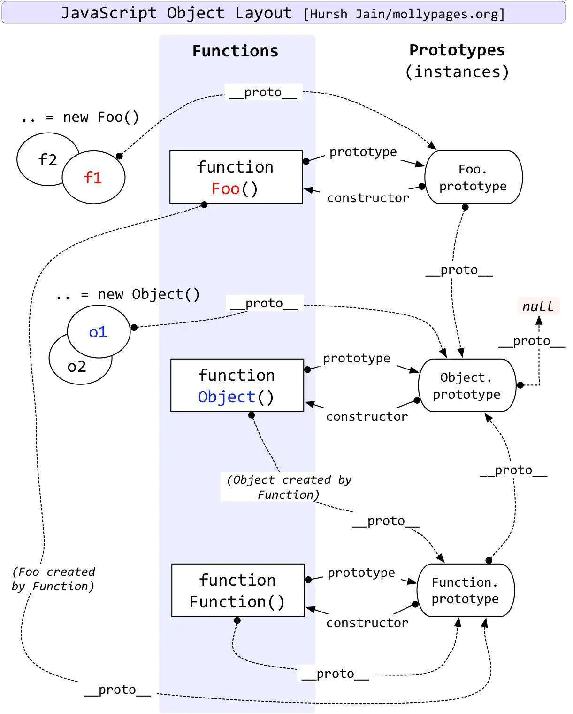

# 1. 语言基础

## 1.1 变量

### 1.1.1 变量声明

------

#### 1.1.1.1 let 和 const 的注意点？

- 1.声明的变量只在声明时的代码块内有效
- 2.不存在声明提升
- 3.存在暂时性死区，如果在变量声明前使用，会报错
- 4.不允许重复声明，重复声明会报错
------

### 1.1.2 变量提升

#### 1.1.2.1 变量提升与函数提升有何区别？

+ 针对变量的声明提升（var声明），只有变量的**定义声明**才会被提升，变量的**赋值声明**不会被提升。

```js
console.log(a); // 2
var a = 2;
```

+ 针对函数的声明提升（直接的函数声明和函数表达式声明），函数声明会被提升，函数表达式（等号后）不会被提升。

```js
foo();
function foo(){
	console.log(a); // undefined
	var a=2;
}

// 提升后，同

function foo(){
	var a;
	console.log(a);
	a=2;
}
foo()
```

+ 函数声明优先于变量声明而提升(函数声明会被提升到普通变量之前），命名重复的声明会被忽略。

```js
foo(); //1 
var foo;
function foo(){
	console.log(1);
}
foo=function(){ // 函数表达式
	console.log(2);
}
// 相当于
```
```js
function foo(){
	console.log(1);
};
// var foo 命名相同被忽略
foo();
foo=function(){
	console.log(2);
}
```

> 没有用var 声明的变量不会提升。


------
------


## 1.2 数据类型

### 1.2.1 数据类型的区分

####  1.2.1.1 介绍js的基本数据类型？


+ js 一共有六种基本数据类型，分别是**Undefined、Null、Boolean、Number、String**，还有在 ES6 中新增的 **Symbol**（和 ES10 中新增的 **BigInt** 类型）。
+ **Symbol** 代表创建后独一无二且不可变的数据类型，它的出现我认为主要是为了解决可能出现的全局变量冲突的问题。
+ **BigInt**是一种数字类型的数据，它可以表示任意精度格式的整数，使用 BigInt 可以安全地存储和操作大整数，即使这个数已经超出了 Number 能够表示的安全整数范围。

#### 1.2.1.2  JavaScript 有几种类型的值？你能画一下他们的内存图吗？

> 涉及知识点：

>> 栈：原始数据类型（Undefined、Null、Boolean、Number、String）
>> 堆：引用数据类型（对象、数组和函数）


>  两种类型的区别是：存储位置不同。
   原始数据类型直接存储在栈（stack）中的简单数据段，占据空间小、大小固定，属于被频繁使用数据，所以放入栈中存储。
>  引用数据类型存储在堆（heap）中的对象，占据空间大、大小不固定。如果存储在栈中，将会影响程序运行的性能；引用数据类型在栈中存储了指针，该指针指向堆中该实体的起始地址。当解释器寻找引用值时，会首先检索其在栈中的地址，取得地址后从堆中获得实体。


  回答：

+  js 可以分为两种类型的值，一种是基本数据类型，一种是复杂数据类型。
+ 基本数据类型....（参考1.2.1）
+ 复杂数据类型指的是 Object 类型，所有其他的如 Array、Date 等数据类型都可以理解为 Object 类型的子类。
+ 两种类型间的主要区别是它们的存储位置不同，基本数据类型的值直接保存在栈中，而复杂数据类型的值保存在堆中，通过使用在栈中保存对应的指针来获取堆中的值。

> 详细资料可以参考：[《JavaScript 有几种类型的值？》](https://blog.csdn.net/lxcao/article/details/52749421) [《JavaScript 有几种类型的值？能否画一下它们的内存图；》](https://blog.csdn.net/jiangjuanjaun/article/details/80327342)

####  1.2.1.3  什么是堆？什么是栈？它们之间有什么区别和联系？

  + **堆**和**栈**的概念存在于数据结构中和操作系统内存中。
  + 在数据结构中，栈中数据的存取方式为**先进后出**。而堆是一个**优先队列**，是按优先级来进行排序的，优先级可以按照大小来规定。**完全二叉树**是**堆**的一种实现方式。
  + 在操作系统中，内存被分为栈区和堆区。**栈区内存**由编译器自动分配释放，存放函数的参数值，局部变量的值等。其操作方式类似于数据结构中的栈。**堆区内存**一般由程序员分配释放，若程序员不释放，程序结束时可能由垃圾回收机制回收。

>  详细资料可以参考：[《什么是堆？什么是栈？他们之间有什么区别和联系？》](https://www.zhihu.com/question/19729973)

####  1.2.1.4 null 和 undefined 的区别？


+ 首先 Undefined 和 Null 都是基本数据类型，这两个基本数据类型分别都只有一个值，就是 undefined 和 null。

+ undefined 代表的含义是*未定义*，null 代表的含义是*空对象*。一般变量声明了但还没有定义的时候会返回 undefined，null主要用于赋值给一些可能会返回对象的变量，作为初始化。

+ undefined 在 js 中不是一个保留字，这意味着我们可以使用 undefined 来作为一个变量名，这样的做法是非常危险的，它会影响我们对 undefined 值的判断。但是我们可以通过一些方法获得安全的 undefined 值，比如说 void 0。

+ 当我们对两种类型使用 typeof 进行判断的时候，Null 类型化会返回 “object”，这是一个历史遗留的问题。当我们使用双等号对两种类型的值进行比较时会返回 true，使用三个等号时会返回 false。

> 详细资料可以参考：[《JavaScript 深入理解之 undefined 与 null》](http://cavszhouyou.top/JavaScript%E6%B7%B1%E5%85%A5%E7%90%86%E8%A7%A3%E4%B9%8Bundefined%E4%B8%8Enull.html)

------

#### 1.2.1.5  Symbol 类型的注意点？

- 1.Symbol 函数前不能使用 new 命令，否则会报错。

- 2.Symbol 函数可以接受一个字符串作为参数，表示对 Symbol 实例的描述，主要是为了在控制台显示，或者转为字符串时，比较容易区分。

- 3.Symbol 作为属性名，该属性不会出现在 for...in、for...of 循环中，也不会被 Object.keys()、Object.getOwnPropertyNames()、JSON.stringify() 返回。

- 4.Object.getOwnPropertySymbols 方法返回一个数组，成员是当前对象的所有用作属性名的 Symbol 值。

- 5.Symbol.for 接受一个字符串作为参数，然后搜索有没有以该参数作为名称的 Symbol 值。如果有，就返回这个 Symbol 值，否则就新建并返回一个以该字符串为名称的 Symbol 值。

- 6.Symbol.keyFor 方法返回一个已登记的 Symbol 类型值的 key。


------

### 1.2.2 数据类型的判断

-------

#### 1.2.2.1  typeof NaN 的结果是什么？

+ NaN 意指“不是一个数字”（not a number），NaN 是一个“警戒值”（sentinel value，有特殊用途的常规值），用于指出数字类型中的错误情况，即“执行数学运算没有成功，这是失败后返回的结果”。

  ```js
  typeof NaN; // "number"
  ```

+ NaN 是一个特殊值，它和自身不相等，是唯一一个非自反（自反，reflexive，即 x === x 不成立）的值。而 NaN != NaN为 true。

------

#### 1.2.2.2  isNaN 和 Number.isNaN 函数的区别？

+ 函数 **isNaN** 接收参数后，会尝试将这个参数转换为数值，任何不能被转换为数值的的值都会返回 true，因此非数字值传入也会返回 true ，会影响 NaN 的判断。
+ 函数 **Number.isNaN** 会首先判断传入参数是否为数字，如果是数字再继续判断是否为 NaN ，这种方法对于 NaN 的判断更为准确。

------

#### 1.2.2.3 typeof 与 instanceof 的区别?

+ **typeof** 操作符(一元运算符）返回一个字符串，表示未经计算的操作数的类型。

运算目标 | 返回值 
:-: | :-: 
Array | "object" 
Boolean | "boolean"  
Function | =="function"== 
Number | "number"
Object | "object"
String | "string"
Undefined  | “undefined” 
Null  | =="object"== 

```js
console.log(typeof 123)   // number
console.log(typeof NaN)  // number
console.log(typeof Infinity) //number
console.log(typeof Number.MIN_VALUE) // number

console.log(typeof true) //boolean
console.log(typeof false) //boolean

console.log(typeof '12rs') 	//string

console.log(typeof undefined) // undefined

console.log(typeof window)  //object
console.log(typeof [])			//object
console.log(typeof null)    	//object

// 函数作为一等公民，可以在typeof判断的时候独立出来。
console.log(typeof Date)   		//function
console.log(typeof  eval)  		//function
console.log(typeof Number) 	// function
```

+ **instanceof** 二元运算符，用于检测构造函数的*prototype*属性是否出现在某个实例对象的*原型链*上。只有引用数据类型（Array，Function，Object，Date ...) 才能被精准判断，其他基础数据类型（Number，Boolean，String) 不能被精确判断。

```js

// 基础数据类型 返回false
console.log(1 instanceof Number)  //false
console.log(true instanceof Boolean) // false
console.log('e' instanceof String) //false

// 引用数据类型 返回true
console.log(new Number(1) instanceof Number) 		 // true
console.log([] instanceof Array)								 //true
console.log([] instanceof Object) 							//true
console.log({} instanceof Object) 							//true
console.log(Date instanceof Function)						// true
console.log(function(){} instanceof Function)		//true
console.log(function(){} instanceof Object) 		//true
```

------

#### 1.2.2.4 如何实现instanceof ？

```js
// instanceof 运算符用于判断构造函数的 prototype 属性是否出现在对象的原型链中的任何位置。
function myInstanceof(left, right) {
  let proto = Object.getPrototypeOf(left), // 获取对象的原型
    	prototype = right.prototype; // 获取构造函数的 prototype 对象
  // 判断构造函数的 prototype 对象是否在对象的原型链上
  while (true) {
    if (!proto) return false;
    if (proto === prototype) return true;
    // 一直沿着原型链向上获取原型的原型
    proto = Object.getPrototypeOf(proto);
  }
}
```

------

#### 1.2.2.5 valueOf 和 toString 的区别？

+ valueOf()方法返回==对象的原始值==。

  - 该原始方法定义于Object.prototype.valueOf().

  - 默认情况下，valueOf方法由Object后面的每个对象继承。但是**Javascript的许多内置对象都重写了该函数**，以实现适合自身的功能需要。每个内置的核心对象都会覆盖此方法以返回适当的值。


| 对象.valueOf() |              返回值               |
| :------------: | :-------------------------------: |
|     Array      |         **数组**对象本身          |
|    Boolean     |              布尔值               |
|      Date      |              毫秒数               |
|    Function    |             函数本身              |
|     Number     |              数字值               |
|     Object     |             对象本身              |
|     String     |             字符串值              |
|       /        | Math 和 Error 对象没有valueOf方法 |

```js
var colors = ["red", "blue", "green"];
console.log(colors.valueOf()); 
//["red", "blue", "green"]

var bool = true;
console.log(bool.valueOf());  //true

var time = new Date();
console.log(time.valueOf());  //1582165191537

var foo=function(){
    return "function";
};
console.log(foo.valueOf());
//f(){return "function"}

var obj = {
   name: 'js',
   age: 25
};
console.log(obj.valueOf());
//{name:'js',age:25}
```


+ toString()方法返回==表示该对象的字符串==。

	- 该原始方法定义于Object.prototype.toString().默认情况下，toString()方法被每个Object对象继承。如果此方法在自定义对象中未被覆盖，toString() 返回 "[object type]"，其中type是对象的类型。

	- *Array,Boolean,RegExp,String,Number,Function,Date*这些都是覆盖了 Object 的 toString 方法。

```js
var obj = new Object()
obj.toString() // "[object Object]"
```

|    对象    |                            返回值                            |
| :--------: | :----------------------------------------------------------: |
|   Array    | 返回由数组中每个值的字符串形式拼接而成的一个以==逗号分隔的字符串== |
|  Boolean   |                   返回布尔对象的字符串形式                   |
|    Date    |                         毫秒数字符串                         |
|  Function  |                     函数本身源代码字符串                     |
|   Number   |                 返回数字对象的字符串表示形式                 |
| ==Object== |                       [object Object]                        |
|   String   |                          字符串本身                          |
|    null    |                            "null"                            |
| undefined  |                         "undefined"                          |

```js
var colors = ["red","blue","green"];
console.log(colors.toString());
//"red,blue,green"
console.log(colors.toString().split(','));
//["red", "blue", "green"]

//数字数组
var arr = [1, 2, 3, 4];
console.log(arr.toString().split(',').map(item => +item));
//[1, 2, 3, 4]
```
------
#### 1.2.2.6  {} 和 [] 的 valueOf 和 toString 的结果是什么？


+ {} 的 valueOf 结果为 {} ，toString 的结果为 "[object Object]"

+ [] 的 valueOf 结果为 [] ，toString 的结果为 ""

------

#### 1.2.2.7  如何精确判断所有的数据类型？

+ 既然可以使用Object.prototype.toString 来判断 ”继承自Object.prototype 实例对象“的类型(我们可以把它看作一个内部的分类，而非传统的面向对象意义上的类)  。那么可以**使用Object.prototype.toString.call(\*)来精确判断所有的数据类型**。

```js
 var toString = Object.prototype.toString;
 toString.call(233); 					//[object Number]
 toString.call('aaa'); 				//[object String]
 toString.call(true); 				//[object Boolean]
 toString.call([]); 					// [object Array]
 toString.call(function(){}); // [object Function]
 toString.call({}); 					// [object Object]

 toString.call(Math);					//[object Math]
 toString.call(new Date());   // [object Date]
 toString.call(new String()); // [object String]
 toString.call(undefined);    // [object undefined]
 toString.call(null); 				// [object Null]	
```

--------

#### 1.2.2.8  内部属性 [[Class]] 是什么？


+ 所有 typeof 返回值为 "object" 的对象（如数组）都包含一个内部属性 [[Class]]，我们可以把它看作一个（引用类型Object）内部的分类，而非传统的面向对象意义上的类。这个属性无法直接访问，一般通过 Object.prototype.toString(..) 来查看。例如：

```js
Object.prototype.toString.call( [1,2,3] );
// "[object Array]"

Object.prototype.toString.call( /regex-literal/i );
// "[object RegExp]"

// 我们自己创建的类就不会有这份特殊待遇，因为 toString() 找不到 toStringTag 属性时只好返回默认的 Object 标签
// 默认情况类的[[Class]]返回[object Object]
class Class1 {}
Object.prototype.toString.call(new Class1()); // "[object Object]"
// 需要定制[[Class]]
class Class2 {
  get [Symbol.toStringTag]() {
    return "Class2";
  }
}
Object.prototype.toString.call(new Class2()); // "[object Class2]"
```

------

------


### 1.2.3 数据类型的比较与转换

------

#### 1.2.3.1  其他值到字符串的转换规则？


+ 规范的 9.8 节中定义了抽象操作 ToString ，它负责处理非字符串到字符串的强制类型转换。

	- （1）Null 和 Undefined 类型 ，null 转换为 "null"，undefined 转换为 "undefined"，

	- （2）Boolean 类型，true 转换为 "true"，false 转换为 "false"。

	- （3）Number 类型的值直接转换，不过那些极小和极大的数字会使用指数形式。

	- （4）Symbol 类型的值直接转换，但是只允许显式强制类型转换，使用隐式强制类型转换会产生错误。

	- （5）对普通对象来说，除非自行定义 toString() 方法，否则会调用 toString()（Object.prototype.toString()）来返回内部属性 [[Class]] 的值，如"[object Object]"。如果对象有自己的 toString() 方法，字符串化时就会调用该方法并使用其返回值。
	
------

#### 1.2.3.2  其他值到数字值的转换规则？


+ 有时我们需要将非数字值当作数字来使用，比如数学运算。为此 ES5 规范在 9.3 节定义了抽象操作 ToNumber。

	- （1）Undefined 类型的值转换为 NaN。

	- （2）Null 类型的值转换为 0。

	- （3）Boolean 类型的值，true 转换为 1，false 转换为 0。

	- （4）String 类型的值转换如同使用 Number() 函数进行转换，如果包含非数字值则转换为 NaN，空字符串为 0。

	- （5）Symbol 类型的值不能转换为数字，会报错。

	- （6）对象（包括数组）会首先被转换为相应的基本类型值，如果返回的是非数字的基本类型值，则再遵循以上规则将其强制转换为数字。

+ 	为了将值转换为相应的基本类型值，抽象操作 ToPrimitive 会首先（通过内部操作 DefaultValue）检查该值是否有valueOf() 方法。如果有并且返回基本类型值，就使用该值进行强制类型转换。如果没有就使用 toString() 的返回值（如果存在）来进行强制类型转换。如果 valueOf() 和 toString() 均不返回基本类型值，会产生 TypeError 错误。

------

#### 1.2.3.3  其他值到布尔类型的值的转换规则？

+ ES5 规范 9.2 节中定义了抽象操作 ToBoolean，列举了布尔强制类型转换所有可能出现的结果。

	- 以下这些是假值：undefined、null、false、+0、-0、NaN 和 ""
	- 假值的布尔强制类型转换结果为 false。从逻辑上说，假值列表以外的都应该是真值。

------


#### 1.2.3.4  什么情况下会发生布尔值的隐式强制类型转换？


+ （1） if (..) 语句中的条件判断表达式。
+ （2） for ( .. ; .. ; .. ) 语句中的条件判断表达式（第二个）。
+ （3） while (..) 和 do..while(..) 循环中的条件判断表达式。
+ （4） ? : 中的条件判断表达式。
+ （5） 逻辑运算符 ||（逻辑或）和 &&（逻辑与）左边的操作数（作为条件判断表达式）。

------

#### 1.2.3.5  || 和 && 操作符的返回值？


+ || 和 && 首先会对第一个操作数执行条件判断，如果其不是布尔值就先进行 ToBoolean 强制类型转换，然后再执行条件判断。

+ 对于 || 来说，如果条件判断结果为 true 就返回第一个操作数的值，如果为 false 就返回第二个操作数的值。

+ && 则相反，如果条件判断结果为 true 就返回第二个操作数的值，如果为 false 就返回第一个操作数的值。

+ || 和 && 返回它们其中一个操作数的值，而非条件判断的结果

------

#### 1.2.3.6  Symbol 值的强制类型转换？

+ ES6 允许从符号到字符串的显式强制类型转换，然而隐式强制类型转换会产生错误。
+ Symbol 值不能够被强制类型转换为数字（显式和隐式都会产生错误），但可以被强制类型转换为布尔值（显式和隐式结果都是 true ）。

------
#### 1.2.3.7   == 操作符的强制类型转换规则？

（1）字符串和数字之间的相等比较，将字符串转换为数字之后再进行比较。

（2）其他类型和布尔类型之间的相等比较，先将布尔值转换为数字后，再应用其他规则进行比较。

（3）null 和 undefined 之间的相等比较，结果为真。其他值和它们进行比较都返回假值。

（4）对象和非对象之间的相等比较，对象先调用 ToPrimitive 抽象操作后，再进行比较。

（5）如果一个操作值为 NaN ，则相等比较返回 false（ NaN 本身也不等于 NaN ）。

（6）如果两个操作值都是对象，则比较它们是不是指向同一个对象。如果两个操作数都指向同一个对象，则相等操作符返回 true，否则，返回 false。


> 详细资料可以参考：[《JavaScript 字符串间的比较》](https://www.jeffjade.com/2015/08/28/2015-09-02-js-string-compare/)
------

#### 1.2.3.8 如何将字符串转化为数字，例如 '12.3b'?

（1）使用 Number() 方法，前提是所包含的字符串不包含不合法字符。

（2）使用 parseInt() 方法，parseInt() 函数可解析一个字符串，并返回一个整数。还可以设置要解析的数字的基数。当基数的值为 0，或没有设置该参数时，parseInt() 会根据 string 来判断数字的基数。

（3）使用 parseFloat() 方法，该函数解析一个字符串参数并返回一个浮点数。

（4）使用 + 操作符的隐式转换。

> 详细资料可以参考：[《详解 JS 中 Number()、parseInt() 和 parseFloat() 的区别》](https://blog.csdn.net/m0_38099607/article/details/72638678)

------

#### 1.2.3.9 如何将浮点数点左边的数每三位添加一个逗号，如 12000000.11 转化为『12,000,000.11』?

```js
// 方法一
function format(number) {
  return number && number.replace(/(?!^)(?=(\d{3})+\.)/g, ",");
}
// 方法二
function format1(number) {
  return Intl.NumberFormat().format(number)
}
// 方法三 ✅
function format2(number) {
  return number.toLocaleString('en')
}
```

------

#### 1.2.3.10  Object.is() 与原来的比较操作符 “ === ” 、 “ == ” 的区别？

+ 使用双等号进行相等判断时，如果两边的类型不一致，则会进行强制类型转化后再进行比较。

+ 使用三等号进行相等判断时，如果两边的类型不一致时，不会做强制类型准换，直接返回 false。

+ 使用 **Object.is(value1,value2)**来进行相等判断时，一般情况下和三等号的判断相同，它处理了一些特殊的情况，比如 -0 和 +0 不再相等，两个 NaN 认定为是相等的。

------

------


## 1.3 函数、作用域与内存
------
### 1.3.1 js的词法作用域

+ 作用域是指程序源代码中定义变量的区域。
+ 作用域规定了如何查找变量，也就是确定当前执行代码对变量的访问权限。
+ JavaScript 采用==词法作用域==(lexical scoping)，也就是静态作用域。

> 详细资料可以参考：[《JavaScript深入之词法作用域和动态作用域》](https://github.com/mqyqingfeng/Blog/issues/3)
------
### 1.3.2 执行上下文栈

+ 变量或函数的上下文决定了他们可以访问哪些数据，以及他们的行为。执行上下文，即”代码的执行环境“。
+ js可执行代码的类型有哪些？（执行上下文的类型？代码的执行环境？）
	- 全局代码，函数代码，eval代码。
+ 执行上下文有三个重要属性：变量对象，作用域链，this。

> 详细资料可以参考：[《JavaScript深入之执行上下文栈》](https://github.com/mqyqingfeng/Blog/issues/4) 、 [《JavaScript深入之执行上下文》](https://github.com/mqyqingfeng/Blog/issues/8) 

------
### 1.3.3 变量对象

+ 变量对象（variable object，VO）
+ 变量对象是与执行上下文相关的数据作用域，存储了在上下文中定义的变量和函数声明。

> 详细资料可以参考：[《JavaScript深入之变量对象》](https://github.com/mqyqingfeng/Blog/issues/5)

------

### 1.3.4 作用域链

+ 当查找变量的时候，会先从当前上下文的变量对象中查找，如果没有找到，就会从父级(词法层面上的父级)执行上下文的变量对象中查找，一直找到全局上下文的变量对象，也就是全局对象。这样由多个执行上下文的变量对象构成的链表就叫做作用域链。
+ 作用域链的本质上是一个**指向变量对象指针列表**。变量对象是一个包含了执行环境中所有变量和函数的对象。作用域链的前端始终都是当前执行上下文的变量对象。全局执行上下文的变量对象（也就是全局对象）始终是作用域链的最后一个对象。当我们查找一个变量时，如果当前执行环境中没有找到，我们可以沿着作用域链向后查找。
+ 作用域链的作用是保证对执行环境有权访问的所有变量和函数的有序访问，通过作用域链，我们可以访问到外层环境的变量和函数。
+ 作用域链的创建过程跟执行上下文的建立有关。

> 详细资料可以参考：[《JavaScript 深入理解之作用域链》](https://github.com/mqyqingfeng/Blog/issues/6)

------

### 1.3.5 this 的指向？


+ this 提供了一种更优雅的方式来”隐式传递”一个对象引用，因此可以将API设计得更加简洁并且易于复用。在js中，this的存在，使得函数可以自动引用合适的上下文对象。
+ this 是在运行时进行绑定的。this的绑定和函数的声明位置没有任何关系，只取决于函数的调用方式。
+ this 是执行上下文中的一个属性，它指向最后一次**调用**这个方法的对象。在实际开发中，this 的指向可以通过下面的顺序（四种调用模式）来判断。
	- （1）构造器调用，函数是否在new中调用（new绑定）。如果一个函数用 new 调用时，函数执行前会新创建一个对象，this 指向这个新创建的对象。
	```js
	var bar = new foo()
	```
	- （2）函数是否通过call、apply、bind（显示绑定）调用。如果是，this绑定的是指定的对象。
	```js
	var bar = foo.call(obj1);
	```
	- (3)  函数是否在某个上下文对象中调用（隐式绑定）？如果是，this绑定的是那个上下文对象。
	```js
	var bar = obj2.foo()
	```
	- (4)  函数内部直接调用（默认绑定），严格模式绑定到undefined，非严格模式绑定到全局对象。
	```js
	var bar = foo()
	```

> 关于this的详解，参考：[《JavaScript 深入理解之 this 详解》](https://github.com/mqyqingfeng/Blog/issues/7)

#### 1.3.5.1 关于this的面试题1：判断下面函数的输出。

```js
// 提示：注意判断执行上下文的是如何进出栈的。
var length = 1000;
var obj = {
  length:10,
  fn:function(fn){
    fn();      
    arguments[0]();
  }
};
function fn(){
  console.log(this.length);
}
obj.fn(fn,1,2,3)

/**答案
	1000
	4
**/
// 解释：首先输出1000，是因为第一个函数是直接调用的，其内部this指向window。其次输出4 . 是因为fn是用过arguments对象调用的，其内部this指向arguments对象。这里的arguments对象关联的函数是obj.fn。obj.fn()在调用的时候才能具体确定arguments对象的值。
```


------

### 1.3.6 显式绑定this的几种内置函数（call，apply，bind）
> ECAMScript 3给Function的原型定义了两个方法,它们是Function.prototype.call和Function.prototype.apply 。
>
> 当使用 call 或者 apply 的时候,如果我们传入的第一个参数为 null,函数体内的 this 会指 向默认的宿主对象,在浏览器中则是 window 。但如果是在严格模式下,函数体内的 this 还是为 null.

+ **apply** 接受两个参数,第一个参数<u>指定了函数体内 this 对象的指向</u>，第二个参数为一个带下标的集合,这个集合可以为**数组**,也可以为**类数组** , apply 方法把这个集合中的元素作为参数传递给被调用的函数

```js
var func = function(a,b,c){
	console.log([a,b,c]);// [1,2,3]
};
func.apply(null,[1,2,3])
```
+ **call** 传入的参数数量不固定，跟 apply 相同的是，第一个参数也是<u>代表函数体内的 this 指向</u>，从第二个参数开始往后，每个参数被依次传入函数。

```js
var func = function( a, b, c ){ 
   console.log([a,b,c]); //输出:[1,2,3]
};
func.call( null, 1, 2, 3 );
```
+ call 和 apply 可以给函数传参，并控制函数调用的上下文（改变this的指向），这样可以用来借用其他对象的方法。
```js
var a=Math.max.apply( null, [ 1, 2, 5, 3, 4 ] );
console.log(a);// 输出:5

function sum(num1, num2) {
    return num1 + num2;
};
function callSum(num1, num2) {
    return sum.call(this, num1,num2)
};
console.log(callSum(1, 2))
```
+ ES5 给定了新方法：**bind()**。 bind() 方法会创建一个新的**“函数”实例**，其this值会被绑定到传给bind()的对象。**bind() **方法创建一个新的函数，在 `bind()` 被调用时，这个新函数的 `this` 被指定为 `bind()` 的第一个参数，而其余参数将作为新函数的参数，供调用时使用

```js
window.color = 'red';
var o = {
	color:'blue';
};
function sayColor(){
	console.log(this.color);
};
let objSayColor = sayColor.bind(o);
objSayColor();// blue
```

------

#### 1.3.6.1 手写call函数

```js
// 实现 abc.myCall(A,1,2,3) ,  第二个参数以后是个参数列表。

Function.prototype.myCall = function(context){
  // 【1】判断调用myCall这个函数的对象（函数abc）（这个对象[函数abc]被this指向了：this的隐式调用）：
  if(typeof this !== 'function'){
    console.error('type error')
  };
  let result = null;
  // 【2】获取参数(abc需要的参数）： 第一个参数为this绑定的对象，从第二个参数开始截取
  let args = [...arguments].slice(1);
  // 【3】 判断上下文对象是否存在,如果不存在设置为window
  context = context || window;
  // 【4】将函数（abc）[this 指向他] 作为上下文对象（A)的一个属性
  context.fn = this;
  // 【5】 使用上下文对象来调用这个方法，并保存返回结果。
  result = context.fn(...args);
  // 【6】 删除给上下文对象添加的属性
  delete context.fn;
  // 【7】 返回结果
  return result;
}
```

------

#### 1.3.6.2 手写apply函数

```js
// 实现 abc.myApply(A,[1,2,3]) , 第二个参数是数组（或类数组）。

Function.prototype.myApply = function(context){
  // 【1】判断调用myCall这个函数的对象（函数abc）（这个对象[函数abc]被this指向了：this的隐式调用）：
  if(typeof this !== 'function'){
    throw new TypeError('Error')
    return
  };
  let result = null;
  // 【2】判断 context 是否存在，如果未传入则为 window
  context = context || window ; 
  // 【3】获取第二参数(abc需要的参数）
  let args = arguments[1];
  // 【4】将函数（abc）[this 指向他] 作为上下文对象（A)的一个属性
  context.fn = this;
  // 【5】 第二参数必须存在且是数组类型
  if(args && Array.isArray(args)){
     result = context.fn(...args);
     delete context.fn;
  }else{
     delete context.fn;
     throw new Error('Error');
     return;
  };
  return result;
}
```

#### 1.3.6.3 手写bind函数

```js
// 实现 abc.bind(A,...),在 bind() 被调用时，这个新函数的 this 被指定为 bind() 的第一个参数，而其余参数将作为新函数的参数，供调用时使用.
// 同时要兼顾【柯里化传参】

 Function.prototype.myBind = function () {
   if (typeof this !== 'function') {
      throw new TypeError('Error')
      return
   };
   let args = Array.prototype.slice.call(arguments);
      // 绑定的对象是第一个参数
   const context = args.shift();
   const self = this;
   return function Fn() {
      let args2 = Array.prototype.slice.call(arguments);
      return self.apply( context,args.concat(args2) )
   };
}
```

> 举例验证：兼顾柯里化传参（柯里化参考1.6.4）
```js
function fn1(a, b, c) {
   console.log('this.x', this.x);
   console.log(a, b, c)
}
const fn2 = fn1.myBind({ x: 1 }, 2, 4) // 第二、三个参数：2,4 分别传给了a、b
//const res = fn2(5); // 这里的参数5 传给了c
// this.x 1
// 2 4 5
const obj = new fn2(7)
```
------
> 上面的代码并没有兼顾fn2 函数用作构造函数，通过new调用生成实例对象：this 与绑定对象无关，实例继承调用函数原型上的属性。
> **更优方案**如下:
+ ✅最佳实践：
```js
Function.prototype.myBind = function () {
   if (typeof this !== 'function') {
        throw new TypeError('Error')
        return
    };
   let args = Array.prototype.slice.call(arguments);
   const context = args.shift();
   const self = this;
   let o = function () {};
  // 以下返回的Fn函数是我们要关注的myBind实现的对abc函数的改造结果。
   let Fn = function () {
      let args2 = Array.prototype.slice.call(arguments);
        // 【6】判断Fn是通过new调用的构造函数还是被直接调用的函数
      return self.apply(
          this instanceof o ? this : context,
          args.concat(args2)
        )
    };
   o.prototype = self.prototype;
      // 利用o函数实现中继，=> 原型式继承
   Fn.prototype = new o;
   return Fn;
}
```
> 举例验证 : fn1.bind()返回的fn2实现new fn2 应该实现的功能：
>
> （1）new fn2生成的实例，要继承fn1构造函数原型上的属性。
>
> （2）new 构造函数，其内的this指向生成的实例对象。
```js
function fn1(a, b, c) {
   console.log('this.x', this.x);
   console.log(a, b, c);
  return 'Hello'
}
fn1.prototype.d = '定义在fn1上的d属性';
const fn2 = fn1.myBind({ x: 1 }, 2, 4);
const obj1 = new fn2('thirdP')  // 'this.x'  undefined (new规则下，this和绑定对象无关) 2 4 'thirdP'
const obj2 = fn2('thirdP');     // 'this.x' 1 (直接调用，this绑定到指定的对象) 2 4 thirdP
console.log(obj1.d) //"定义在fn1上的d属性"
console.log(obj2) // "Hello"
```
------

+ 总结：为了实现bind函数要考虑的事项？
	- (1) 通过调用fn1.bind(A,...)返回的函数实例fn2，无论是`new fn2()`调用还是`fn2()`直接调用，都不要忽视`柯里化传参`。
	- (2) 如果fn2通过`new fn2()`调用，fn2作为一个构造函数，调用时其内部的this指向new调用返回的实例对象。同时，这个实例对象可以从fn1函数的原型对象上继承属性。
	- (3) 如果通过`fn2()`直接调用，那么调用时其内部的this指向其传入的第一个参数，这也是字面量意义上的绑定对象；此外，如果fn1内有返回值，还要返回fn1函数的返回值。

------

### 1.3.7 什么是闭包？为什么要使用闭包？

+ **闭包**是指引用了另一个函数作用域中变量的函数，创建闭包的最常见的方式就是在一个函数内创建另一个函数，创建的函数可以访问到当前函数的局部变量。

+ 闭包有两个常用的用途：

  - 闭包的第一个用途是使我们在函数外部能够访问到函数内部的变量。通过使用闭包，我们可以通过在外部调用闭包函数，从而在外部访问到函数内部的变量，可以使用这种方法来创建私有变量。
    
- 函数的另一个用途是使已经运行结束的函数上下文中的变量对象继续留在内存中，因为闭包函数保留了这个变量对象的引用，所以这个变量对象不会被回收。
  
```js
var scope = "global scope";
function checkscope(){
	var scope = "local scope";
	function f(){
		return scope;
	};
	return f;
}
var foo=checkscope();
foo();
// 注意关键：f函数执行的时候，checkscope函数上下文已经从执行上下文栈中弹出，但是因为闭包，所以f执行上下文维护了一个作用域链：即使 checkscopeContext 被销毁了，但是 JavaScript 依然会让 checkscopeContext.AO 活在内存中，f 函数依然可以通过 f 函数的作用域链找到它，正是因为 JavaScript 做到了这一点，从而实现了闭包这个概念。
```

+ 其实`闭包`的本质就是作用域链的一个特殊的应用，只要了解了作用域链的创建过程，就能够理解闭包的实现原理。

> 详细资料可以参考：[《JavaScript 深入理解之闭包》](https://github.com/mqyqingfeng/Blog/issues/9) 、[《技术蛋讲解闭包bilibili》](https://www.bilibili.com/video/BV1iE411q7Qd)

#### 1.3.7.1 修改下面代码，使其循环输出结果依次为1，2，3，4，5.

```js
for(var i=1;i<=5;i++){
	setTimeout(function timer(){
		console.log(i);
	},i*1000);
};

// 方法1：计时函数外层包裹立即执行函数，提供闭包条件
for(var i=1;i<=5;i++){
  (function(i){
    setTimeout(function timer(){
      console.log(i);
    },i*1000)
  })(i)
};

// 方法2：计时器函数的第一个参数使用立即执行函数，提供闭包条件
for(var i=1;i<=5;i++){
  setTimeout((function(i){
    return function(){
      console.log(i);
    }
  })(i),i*1000);
};

// 方法3：es6，let声明
for(let i=1;i<=5;i++){
  setTimeout(function timer(){
    console.log(i);
  },i*1000);
};
```
#### 1.3.7.2 下面函数输出了什么？
```js
for (var i = 0; i < 5; i++) {
   setTimeout(function () {
      console.log(i++);
   }, 4000)
}
// (4s以后)
// 5
// 5
// 5
// 5
// 5
```
#### 1.3.7.3 下面函数输出了什么？
```js
for (var i = 0; i < 5; i++) {
   setTimeout(function () {
      console.log(i++);
   }, 4000)
}
console.log(i)
// 输出：
//5   (立即输出)

//5  （4秒以后）
//6
//7
//8
//9

// 这里涉及同步任务与异步任务。
// 同步任务i循环五次后，加1，最后一行打印出5. 这期间，任务队列中有五个匿名函数等待执行。
// 4秒之后，队列任务依次执行，首先打印i，i=5，之后再给i+1，一共执行五次。
```
------

### 1.3.8  js中的所有参数都是按值传递的。

+ 参考《高程4》P85页。

+ 参考[《JavaScript 深入理解之参数按值传递》](https://github.com/mqyqingfeng/Blog/issues/10)
+ 高赞评论。

```
我个人认为你的理解有误, 红宝书说ECMAScript中所有函数的参数都是按值传递的, 这是没错的. 关键在于如何理解值传递和引用类型, 这个概念我很早在C#上深入研究一番(在<C#本质论>的指导下). 而JavaScript的引擎是C++实现的, 所以在这一块概念上C#与C++大致一样.
C#的数据类型分为2种: 值类型和引用类型, 而方法参数的传递方式也分为2种: 值传递和引用传递, 这里要强调的是数据类型和方法参数的传递方式没有半毛钱关系. 这两者排列组合后得到4种情况: 1. 方法参数类型是值类型, 用值传递; 2. 方法参数类型是引用类型, 用值传递; 3. 方法参数类型是值类型, 用引用传递; 4. 方法参数类型是引用类型, 用引用传递.
ECMAScript如何实现方法参数用引用传递, 我实际使用中没用到过, 这里不敢妄言, 但是你在"引用传递"中举的例子, 很明显是错误的, 它只是方法参数是引用类型, 但是用的是值传递方式, 这也印证了红宝书上说的那句话.
下面我先说说C#里的这4种情况.
首先, 弄清楚方法参数传递方式. C#区分值传递和引用传递很方便, 方法参数前加ref(out修饰符这里不讨论)就是引用传递, 什么都不加就是值传递. 我们都知道方法参数有实参和形参之说, 而参数传递方式说的就是从实参给形参复制的过程. 值传递就是把实参在内存栈中的数据传递给形参, 然后你在方法内部就可以使用形参了, 而引用传递是把实参的内存栈的地址编号传递给形参.
其次, 弄清楚数据类型, 值类型就是内存中某个地址直接保存了值, 比如int i = 10;(js对应写法: var i = 10;), 运行时会在内存的栈中分配一个地址001, 并在这个地方保存10. 而引用类型则需要在内存中某个地址先保存实际的对象实例, 然后在内存的另一个地址保存指向那个对象实例的指针, 比如MyClass obj = new MyClass { value = 10 };(js对应写法: var obj = { value: 10 };), 运行时首先在内存的托管堆中保存一个MyClass的实例对象, 它的属性value=10, 再到内存的栈中分配一个地址002, 并在这里保存在托管堆中那个对象的内存地址(我们可以把这个内存地址简化理解成指向对象实例的指针). 这就是值类型和引用类型的区别.
回过来再看你的例子, 第一个是"按值传递", 这个例子符合方法参数是值类型并用值传递这种情况, value是值类型, 它在内存栈中的地址001保存了1这个数值, 在foo(value);这句, value是实参, 而foo函数声明中的v是形参, js引擎在内存栈中为形参v分配了一个地址002, 其中也保存了1这个值, 这时修改v的值, 是修改内存地址002里的值, 而地址001里的值没变, 所以在foo函数执行完, 再打印value时, 依然是1.
接下来看第二个"引用传递", 我认为这个说法是错误的, 正确的说法应该是引用类型并用值传递. obj是引用类型, 它需要在内存堆中(js引擎可能不存在托管的概念, 所以这里称为内存堆)分配一个内存地址012, 保存了它的一个对象(属性value和其值1, 这句说的不严谨, 不过不影响对本例的分析), 并在内存栈中分配了一个地址011, 这个地址保存了012(就是那个内存堆的地址, 可以理解为指针). 在foo(obj);这句, obj是实参, 而foo函数声明中的o是形参, js引擎在内存栈中为形参o分配了一个地址013, 其中也保存了012这个值, 012其实并不是像前一个例子中说的1那样的数值, 而是一个内存地址, 所以如果你打印o这个形参, 它不会把012这个值打印出来, 而是把012内存地址里保存的实例对象给打印出来. 到这里就很清楚了, 如果你修改了012指向的那个对象的属性value的值, 那么当你在打印obj这个实参时, 它的obj.value会打印出2, 而不是1.
你的第三个例子"共享传递", "共享传递"这个概念我不是很清楚, 但我觉得你举的这个例子依然是值传递, 唯一与C#不同的是, C#的变量类型定义后不能改变, 而JS的变量类型是可以随意改变的, 因此这个例子无法跟C#中的值传递来类比. 再来分析你这个例子, 首先obj实例化一个对象, 有一个属性value, 值为1, 在内存中就是现在内存堆中分配一个内存空间, 其地址为022, 保存了一个对象(包括它的属性value和值1), 然后再到内存栈中分配一个内存地址021, 保存了内存地址022这个值. 在foo(obj);这句, obj是实参, 而o是形参, 这时在内存栈中给形参o分配了一个地址023, 也保存022这个值(如果在o=2;之前打印o, 将输出undefined, 这里是由于在foo函数作用域内对变量o进行赋值操作, 因此在这个作用域内使用了局部变量o覆盖了形参o, 而局部变量o在使用时没有声明, 所以js引擎会把它的声明提升到作用域最顶部, 因此在赋值语句之前打印, 会输出undefined, 声明提升这个概念暂时也不深入展开感谢@daizengyu123 的指正, 这里因为调用foo函数时给形参o赋值了, 所以在调用o = 2;之前打印, 会输出对象{value: 1}), 而在foo函数中, 又给形参o重新赋值2, 由于2是Number类型, 这是值类型, 因此不用在内存堆中存储数据, 直接在内存栈中即可, 这句赋值语句, 相当于把内存地址023中的值022改为2, 而并没有修改内存地址021(也就是变量obj)的值, 所以在调用foo函数之后再打印obj.value时, 仍然打印出1. 这里如果把o = 2;这句替换为o = { value = 5, other = "abc" };也是同理.
最后补充一下C#中的引用类型的值传递和引用类型的引用传递的对比. 简单来说, 引用类型的值传递, 在方法内部如果对形参重新赋值, 哪怕是同一个类的对象, 在赋值后修改对象的属性, 实参的对应的属性值都不会改变, 同时实参指向的对象也不变, 而形参在重新赋值后已经指向一个新的对象了; 而引用类型的引用传递, 在方法内部如果对形参重新赋值, 那么实参也跟着重新赋值, 实参最初所指向的那个对象将不被任何变量所指向.
```

------

### 1.3.9  类数组对象

#### 1.3.9.1 什么是类数组对象？

+ 一个拥有 length 属性和若干索引属性的对象就可以被称为**类数组对象**，类数组对象和数组类似，但是不能调用数组的方法。

+ 常见的类数组对象有 arguments 和 DOM 方法的返回结果，还有一个函数也可以被看作是类数组对象，因为它含有 length属性值，代表可接收的参数个数。

#### 1.3.9.2 常见的 类数组转换为数组的方法有哪些？

+ （1）通过 call 调用数组的 slice 方法来实现转换

  ```js
  Array.prototype.slice.call(arrayLike);
  ```

+ （2）通过 call 调用数组的 splice 方法来实现转换

  ```js
  Array.prototype.splice.call(arrayLike, 0);
  ```

+ （3）通过 apply 调用数组的 concat 方法来实现转换

  ```js
  Array.prototype.concat.apply([], arrayLike);
  ```

+ （4）通过 Array.from 方法来实现转换

  ```js
  Array.from(arrayLike);
  ```

+  （5）通过[...arrayLike] 转化为数组
```js
  // 某函数内部
  var arr = [...arguments];
```
> 详细的资料可以参考：[《JavaScript 深入之类数组对象与 arguments》](https://github.com/mqyqingfeng/Blog/issues/14)、[《javascript 类数组》](https://segmentfault.com/a/1190000000415572)、[《深入理解 JavaScript 类数组》](https://blog.lxxyx.cn/2016/05/07/%E6%B7%B1%E5%85%A5%E7%90%86%E8%A7%A3JavaScript%E7%B1%BB%E6%95%B0%E7%BB%84/)

------

### 1.3.10 垃圾回收

> Javascript 是使用垃圾回收的语言，也就是说执行环境负责在代码执行时管理内存。通过自动内存管理实现内存分配和闲置资源回收。垃圾回收程序必须追踪和记录哪个变量还会使用，哪个变量不再使用了，以便回收内存。
------
#### 1.3.10.1 垃圾回收的两种策略

+ **标记清理**：当变量进入上下文，这个变量会被加上存在于上下文中的`标记`。当变量离开上下文时，也会被加上离开上下文的`标记`。垃圾回收程序运行时，会标记内存中存储的所有变量，然后他会将所有在上下文中的变量，以及被在上下文中的变量引用的变量的`标记`去掉。在此之后再被加上`标记`的变量就是待删除的了，原因是任何在上下文中的变量都访问不到它们了。随后垃圾回收程序会做一次`内存清理`，销毁带标记的所有值并回收它们的内存。
+ **引用计数**：统计对象被引用的次数，每次发现对象被引用了，就给它次数+1，删除引用就-1，为0的时候就可以回收。引用计数这种策略使用较少，同时可能会出现循环引用的问题。JS引擎不再使用这种算法，因为js会访问非原生js对象，如dom元素。

------

#### 1.3.10.2 垃圾回收与内存管理

+ ***通过let和const 声明提升性能***：这两个ES6新增的关键字有助于改善垃圾回收的过程，因为两者都以块为作用域，相比使用var，使用这两个关键字可能会更早地让垃圾回收程序接入，尽早地回收应该回收的内存。

+ V8引擎将解释后的js代码编译为实际的机器码时，会利用”隐藏类“，使用delete关键字会导致生成相同的隐藏类片段。隐藏类的改变频率和大小可能会对性能产生明显影响。最佳实践是***把不想要的属性设置为null***。这样可以保持隐藏类不变和继续共享，同时也能达到删除引用值供垃圾回收程序回收的效果。

------

#### 1.3.10.3 哪些操作会造成内存泄漏？

- 1.意外的全局变量
- 2.被遗忘的计时器或回调函数
- 3.脱离 DOM 的引用
- 4.闭包
> (1) 第一种情况是我们由于使用未声明的变量，而意外的创建了一个全局变量，而使这个变量一直留在内存中无法被回收。
> (2) 第二种情况是我们设置了 setInterval 定时器，而忘记取消它，如果循环函数有对外部变量的引用的话，那么这个变量会被一直留在内存中，而无法被回收。
> (3) 第三种情况是我们获取一个 DOM 元素的引用，而后面这个元素被删除，由于我们一直保留了对这个元素的引用，所以它也无法被回收。
> (4)第四种情况是不合理的使用闭包，从而导致某些变量一直被留在内存当中。

> 详细资料可以参考：[《JavaScript 内存泄漏教程》](http://www.ruanyifeng.com/blog/2017/04/memory-leak.html)、[《4 类 JavaScript 内存泄漏及如何避免》](https://jinlong.github.io/2016/05/01/4-Types-of-Memory-Leaks-in-JavaScript-and-How-to-Get-Rid-Of-Them/)、[《杜绝 js 中四种内存泄漏类型的发生》](https://juejin.im/entry/5a64366c6fb9a01c9332c706)、[《javascript 典型内存泄漏及 chrome 的排查方法》](https://segmentfault.com/a/1190000008901861)

------

## 1.4 面向对象编程

### 1.4.1 创建对象的多重方式及优缺点?

+ 1. **工厂模式**：工厂模式的主要原理是用函数来封装创建对象的细节，从而通过调用函数来达到复用的目的。但是他有一个很大的问题就是穿件出来的对象无法和某个类型联系起来，它只是简单的封装了复用代码，而*没有建立起对象和函数类型间的关系*。

```js
function createPerson(name,age,job){
	let o = new Object();
	o.name = name;
	o.age = age;
	o.job = job;
	o.sayName = function(){
		console.log(this.name);
	};
	return o;
}
let person1 = createPerson('Nicholas',29,'Software Engineer');
let person2 = createPerson('Greg','27,'Doctor');
```

+ 2. **构造函数模式**：
	- （1）使用new操作符，调用构造函数创建对象，具体发生了什么？
		+ ① 在内存中创建一个新对象；
		+ ② 这个新对象内部的__proto__特性被赋值为构造函数的prototype属性；
		+ ③ 构造函数内部的this指向这个新创建的对象；
		+ ④ 执行构造函数内部的代码；
		+ ⑤ 如果构造函数返回非空对象，则返回该对象；否则返回刚创建的新对象。
	+ （2）构造函数有什么优缺点？
		- ① 构造函数模式相对于工厂模式的优点是，所创建的对象和构造函数建立起了联系，因此我们可以通过原型来识别对象的类型。
		- ② 构造函数存在的一个缺点是，其*定义的方法会在每个实例上都创建一遍，浪费了不必要的内存空间*。

```js
function Person(name,age,job){
	this.name = name;
	this.age =age;
	this.job = job;
	this.sayName = function(){ // 这里逻辑等价于 new Function(...)
		console.log(this.name);
	};
}
let person1 = createPerson('Nicholas',29,'Software Engineer');
let person2 = createPerson('Greg','27,'Doctor');
person1.sayName();// Nicholas
person2.sayName();// Greg
```

+ 3. **原型模式**：
	- 因为每一个函数都有一个 prototype 属性，这个属性是一个对象，它包含了通过构造函数创建的所有实例都能共享的属性和方法。因此我们可以使用原型对象来添加公用属性和方法，从而实现代码的复用。这种方式相对于构造函数模式来说，解决了函数对象的复用问题。但是这种模式也存在一些问题，一个是没有办法通过传入参数来初始化值，另一个是如果存在一个引用类型如 Array 这样的值，那么所有的实例将共享一个对象，*一个实例对引用类型值的改变会影响所有的实例*。

```js
function Person(){}
Person.prototype = {
	constructor:Person,
	name:"Nicholas",
	age:29,
	job:'software Engineer',
	friends:["Shelby","Court"] // 属性值为“引用类型”
}
let person1 = new Person();
let person2 = new Person();
person1.friends.push("Van"); 
console.log(person2.friends); // "Shelby,Court,Van"
```
> 一般来说，不同的实例应该有属于自己的属性副本，这就是实际开发中通常不使用原型模式的原因。

> 详细资料可以参考：[《JavaScript 深入理解之对象创建》](http://cavszhouyou.top/JavaScript%E6%B7%B1%E5%85%A5%E7%90%86%E8%A7%A3%E4%B9%8B%E5%AF%B9%E8%B1%A1%E5%88%9B%E5%BB%BA.html)

------
### 1.4.2 对象的比较

#### 1.4.2.1 如何判断两个数组相等(键值对完全相等）？
> 涉及到简单类型数据的比较和复杂数据类型的比较。复杂数据类型可以通过递归化解为简单数据类型的比较。
```js
// 用来过滤掉简单的类型比较，复杂的对象使用 deepEq 函数进行处理
function eq(a, b) {
    // === 结果为 true 的区别出 +0 和 -0
    if (a === b) return a !== 0 || 1 / a === 1 / b;
    // typeof null 的结果为 object ，这里做判断，是为了让有 null 的情况尽早退出函数
    if (a == null || b == null) return false;
    // 判断 NaN
    if (a !== a) return b !== b;
    // 判断参数 a 类型，如果是基本类型，在这里可以直接返回 false
    var type = typeof a;
    if (type !== 'function' && type !== 'object' && typeof b != 'object') return false;
    // 更复杂的对象使用 deepEq 函数进行深度比较
    return deepEq(a, b);
};
function deepEq(a,b){
	if(Array.isArray(a)&& Array.isArray(b)){
		length = a.length;
		if(length !==b.length) return false;
		// 递归遍历
		while(length--){
			if(!eq(a[length],b[length])) return false;
		}
	}
	else throw new TypeError('TypeError')
};
```

#### 1.4.2.2 如何判断两个普通对象相等(键值对及排列顺序完全相等）？

+ 方法1：递归遍历
```js
// 使用上述eq函数
function isSimpleObj(obj){
	return Object.prototype.toString.call(obj)==='[object Object]';
}
function deepEq(a,b){
	if(isSimpleObj(a)&&isSimpleObj(b)){
		var keys = Object.keys(a),key;
		length = keys.length;
		if(Object.keys(b).length!==length) return false;
		while(length--){
			key = keys[length];
			if(!(b.hasOwnProperty(key)&&eq(a[key],b[key]))){
				return false;
			}
		}
	}
}
```
+ 方法2：**JSON.stringify(obj)** 把对象转换成字符串后比较。
	- 优点：用法简单，对于顺序相同的两个对象可以快速进行比较得到结果

> 当两个对比的对象中只有key的顺序不是完全相同时，依然认为“对象相等”，这个时候，不能使用上面的两种方法判断。
>
> **object.keys()** 方法会返回一个由一个给定对象的自身可枚举属性组成的数组，数组中属性名的排列顺序和正常循环遍历该对象时返回的顺序一致 。
>
> 详细资料：[JavaScript专题之如何判断两个对象相等](https://github.com/mqyqingfeng/Blog/issues/41) 、 [如何对比js中两个对象是否相等](https://www.jianshu.com/p/90ed8b728975)


------

### 1.4.2 深拷贝与浅拷贝

- 浅拷贝是创建一个新对象，这个对象有着原始对象属性值的一份精确拷贝。如果属性是基本类型，拷贝的就是基本类型的值，如果属性是引用类型，拷贝的就是内存地址 ，所以**如果其中一个对象改变了这个地址，就会影响到另一个对象**。

- 深拷贝是将一个对象从内存中完整的拷贝一份出来,从堆内存中开辟一个新的区域存放新对象,且**修改新对象不会影响原对象**。
```js
var a1 = {b: {c: {}};

var a2 = shallowClone(a1); // 浅拷贝方法
a2.b.c === a1.b.c // true 新旧对象还是共享同一块内存

var a3 = deepClone(a3); // 深拷贝方法
a3.b.c === a1.b.c // false 新对象跟原对象不共享内存
```
> 详细资料：[前端工匠:一文读懂js深拷贝与浅拷贝](https://github.com/ljianshu/Blog/issues/5)

------

### 1.4.3 原型链

#### 1.4.3.1  什么是js中的原型？原型链？有什么特点？

+ 在 js 中我们是使用构造函数来新建一个对象的，每一个构造函数的内部都有一个 prototype 属性值，这个属性值是一个对象，这个对象包含了可以由该构造函数的所有实例共享的属性和方法。当我们使用构造函数新建一个对象后，在这个对象的内部将包含一个指针，这个指针指向构造函数的 prototype 属性对应的值，在 ES5 中这个指针被称为对象的原型。一般来说我们
  是不应该能够获取到这个值的，但是现在浏览器中都实现了\_\_proto\_\_ 属性来让我们访问这个属性，但是我们最好不要使用这个属性，因为它不是规范中规定的。ES5 中新增了一个**Object.getPrototypeOf() **方法，我们可以通过这个方法来获取对象的原型。

+ 当我们访问一个对象的属性时，如果这个对象内部不存在这个属性，那么它就会去它的原型对象里找这个属性，这个原型对象又会有自己的原型，于是就这样一直找下去，也就是原型链的概念。原型链的尽头一般来说都是 Object.prototype 所以这就是我们新建的对象为什么能够使用 toString() 等方法的原因。

+ 特点：
  
  - JavaScript 对象是通过引用来传递的，我们创建的每个新对象实体中并没有一份属于自己的原型副本。当我们修改原型时，与之相关的对象也会继承这一改变。

<div align="center">
	
</div>


> 详细资料可以参考：[《JavaScript 深入理解之原型与原型链》](http://cavszhouyou.top/JavaScript%E6%B7%B1%E5%85%A5%E7%90%86%E8%A7%A3%E4%B9%8B%E5%8E%9F%E5%9E%8B%E4%B8%8E%E5%8E%9F%E5%9E%8B%E9%93%BE.html) 、[前端工匠:原型与原型链详解](https://github.com/ljianshu/Blog/issues/18)

------
#### 1.4.3.2  js中获取原型有哪些方法？

- p.\_\_proto\_\_
- p.constructor.prototype
- **Object.getPrototypeOf(p)**
-------

#### 1.4.3.3 如何判断一个属性是否存在于原型对象上？
+ **obj.hasOwnProperty(prop)** ：只有当属性prop存在于实例对象obj时才返回true。
+ **in** 操作符：单独使用in操作符时，in操作符会在可以通过对象访问指定属性时返回true，无论这个属性是在实例上还是原型上。
```js
// 判断一个属性是否定义在了原型对象上
function hasPrototypeProperty(object,name){
	// 实例对象上没有该属性 且 in操作符返回true
	return !object.hasOwnProperty(name) && (name in object);
}
```

------

### 1.4.4 继承的多种方式及优缺点。

+ 1. 以**原型链**的方式实现继承:
	- 这种实现方式存在的缺点是，在包含有引用类型的数据时，原型中的引用值会被所有的实例对象所共享，容易造成修改的混乱。还有就是在子类型实例化时不能向父类型的构造函数传递参数。
```js
function SuperType(){
	this.color = ["red","blue","green"];
}
function SubType(){};
// 继承
SubType.prototype = new SuperType();

let instance1 = new SubType();
instance1.colors.push('black');
console.log(instance1.colors); //"red,blue,green,black"

let instance2 = new SubType();
console.log(intance2.colors); //"red,blue,green,black"
```

+ 2. **盗用构造函数**
	- 这种方式是通过在子类型的函数中调用父类型的构造函数来实现的。这一种方法解决了不能向父类型传递参数的缺点，但是它存在的一个问题就是无法实现函数方法的复用，并且父类型原型定义的方法子类型也没有办法访问到。
```js
function SuperType(name){
	this.name = name;
};
function SubType(){
  // 借用父类构造函数，并在子类构造函数中向父类构造函数传参
	SuperType.call(this,'Nicholas');
	// 调用父类构造函数后，还可以再给子类实例添加额外的属性
	this.age=29;
};
let instance = new SubType();
console.log(instance.name); //'Nicholas'
console.log(instance.age);// 29
```

+ 3. **组合继承**：
	- 组合继承综合了原型链和盗用构造函数，<u>通过盗用构造函数继承实例属性，通过原型对象来继承原型上的属性和方法</u>。组合继承弥补了原型链和盗用构造函数的不足，是javascript中使用最多的继承模式。但是有一点不足的就是，因为使用了两种不同的模式，所以对于代码的封装性不够好。

```js
function SuperType(name){
	this.name = name;
	this.colors = ['red','blue','green'];
}
SuperType.prototype.sayName = function(){
	console.log(this.name);
}
function SubType(name,age){
	// 继承属性
	SuperType.call(this,name);
	this.age=age;
}
// 继承方法
SubType.prototype = new SuperType();
SubType.prototype.sayAge = function(){
	console.log(this.age);
};
let instance1 = new SubType('Nicholas',29);
let instance2 = new SubType('Greg',27);
instance1.colors.push('black')
console.log(instance1.colors); // "red,blue,green,black"
console.log(instance2.colors);// "red,blue,green"
```

+ 4. **原型式继承**
	- 原型式继承的主要思路就是<u>基于已有的对象来创建新的对象</u>，实现的原理是，向函数中传入一个对象，然后返回一个以这个对象为原型的对象。这种继承的思路主要不是为了实现创造一种新的类型，只是对某个对象实现一种简单继承，ES5 中定义的 `Object.create()` 方法就是原型式继承的实现。缺点与原型链方式相同。
```js
function object(o){
  function F(){};
  F.prototype = o;
  return new F();
}
//object 函数会创建一个临时构造函数，将传入的对象赋值给这个构造函数的原型，然后返回这个临时类型的一个实例。
// ES5 通过增加Object.create() 方法将原型式继承的概念规范化了。
let person = {
  name:'Nicholas',
  friend:['Shelby','Court','Van'];
}
let anotherPerson = object(person);
anotherPerson.name = 'Greg';
anotherPerson.friends.push('Rob');

let yetAnotherPerson = object(person);
yetAnotherPerson.name = 'Linda';
yetAnotherPerson.friends.push('Barbie');

console.log(person.friends) // 'Shelby','Court','Van','Rob','Barbie'
// 属性中包含的引用值始终会在相关对象间共享
```

+ 5. **寄生式继承**
	- 寄生式继承的思路是创建一个用于封装继承过程的函数，通过传入一个对象，然后复制一个对象的副本，然后增强这个对象，最后返回这个对象。这个扩展的过程就可以理解是一种继承。这种模式的缺点是无法实现内部”增强函数“的复用,与构造函数模式类似。
```js
function createAnother(original){
	let clone = object(original);   // 通过调用函数创建一个对象
	clone.sayHi = function(){      // 增强这个对象
		console.log('hi');
	};
	return clone;
};

let person = {
	name:'Nicholas',
	friends:['Shelby','Court','Van']
};
let anotherPerson = createAnother(person);
anotherPerson.sayHi(); // 'hi'
```

+ 6. **✅ 寄生式组合继承** 
	- 组合继承存在效率问题，父类构造函数始终会被调用两次，一次是在创建子类原型的时候调用，另一次是在子类构造函数中调用。
	- 寄生式组合继承的基本思路是使用**父类型的原型**作为子类型的原型,这样只调用了一次父类构造函数，效率更高。`寄生式组合继承`是引用类型继承的最佳模式。

```js
// 实现函数： 将父类原型 赋值给 子类的原型
function inheritPrototype(subType, superType){
	let prototype = object(superType.prototype);
  			// 或者 = Object.create(superType.prototype); //ES5
	prototype.constructor = subType;
	subType.prototype = prototype;
};

function SuperType(name){
	this.name = name;
	this.colors = ['red','blue','green'];
};
SuperType.prototype.sayName = function(){
	console.log(this.name);
};
function SubType(name,age){
	// 父类构造函数只在这里调用一次
	SuperType.call(this,name);
	this.age = age;
};
inheritPrototype(SubType,SuperType);
SubType.prototype.sayAge = function(){
	console.log(this.age);
};
```
------

### 1.4.5 类

#### 1.4.5.1 什么是js的类？有哪些特点？

+ ES6 新引入了**class**关键字具有定义类的能力。类是ES6新增的基础性语法糖结构。
+ 定义类有两种主要方式：类声明和类表达式。
```js
// 类声明
class Person{}
// 类表达式
const Animal = class {} 
```
+ 与函数定义不同，函数声明可以提升，但类定义不能提升。
+ 类受块作用域的限制。
+ 默认情况下，类中定义的代码都在严格模式下执行。
+ 把类表达式赋值给变量后，可以通过name属性获取类表达式的名称。
+ **constructor**关键字用于在类内部定义块内部创建类的构造函数。方法名constructor会告诉解释器使用new操作符创建类的实例时，应该调用这个函数。类实例化时传入的参数会用作构造函数的参数。
+ 通过typeof标识符检测类标识符，表明它是一个函数。（返回`function`）。
+ 使用**instanceof**操作符可以检测构造函数的原型是否出现在实例的原型链上。类标签符也有prototype属性，而这个原型也有一个constructor属性指向类自身。
```js
class Person{};
let p = new Person();
console.log(p instanceof Person);// true 
```
+ 在类的上下文中，类本身在使用new调用时就会被当成构造函数，而类中定义的constructor方法不会被当成构造函数，在对它使用**instanceof**操作符时会返回false。
+ 可以把方法定义在`类构造函数`中或`类块`中。在`类块`中定义的所有内容都会出现在类的原型上。
```js
class Person{
  constructor(){
  // 这里相当于构造函数
    this.locate = ()=>console.log('instance')
  }
  // 这里相当于构造函数的原型对象
  locate(){
    console.log('prototype')
  }
}
```

> 详细资料可以参考：[《ECMAScript 6 实现了 class，对 JavaScript 前端开发有什么意义？》](https://www.zhihu.com/question/29789315)
> [《Class 的基本语法》](http://es6.ruanyifeng.com/#docs/class)


------

#### 1.4.5.2 如何判断一个对象是否属于某个类？

+ 1. 使用 **instanceof** 运算符来判断构造函数（类）的 prototype 属性是否出现在对象的原型链中的任何位置。
+ 2. 通过对象的 constructor 属性来判断: 对象的 constructor 属性指向该对象的构造函数，但是这种方式不是很安全，因为 constructor 属性可以被改写。
+ 3. 如果需要判断的是某个内置的引用类型的话，可以使用 Object.prototype.toString() 方法来打印对象的[[Class]] 属性来进行判断。

> 详细资料可以参考：[《js 判断一个对象是否属于某一类》](https://blog.csdn.net/haitunmin/article/details/78418522)

------


## 1.5 数组

### 1.5.1 数组有哪些原生方法？

> 以下红色加粗或显示带🖍的方法的表示这些方法会直接改变原数组。

#### 1.5.1.1 增

+ <font color=red>**push()**</font> 🖍方法接收任意数量的参数，并将它们添加到数组的末尾，返回数组的最新长度。
```js
let colors = ['black'];
let count = colors.push('red','blue');
console.log(count);// 3  
console.log(colors);// ['black','red','blue']
```

+ <font color=red>**unshift()**</font>🖍方法在数组开头添加任意多个值，然后返回新数组的长度。
```js
let colors = ['black'];
let count = colors.unshift('red','blue');
console.log(count);// 3  
console.log(colors);// ['red','blue','black']
```

+ <font color=red>**splice()**</font>🖍方法传入三个参数，分别是开始位置、要删除的元素的数量、插入的元素。**splice()**方法会返回被删除的元素组成的数组，如果没有元素被删除，则返回空数组。
```js
// (只增未删)
let colors = ["red","green","blue"];
let removed = colors.splice(1,0,"yellow","orange");
console.log(colors);// ["red","yellow","orange","green","blue"]
console.log(removed);//[] 
```

+ <font color=green>**concat()**</font> 方法首先会创建一个当前元素的副本，然后再把它的参数添加到副本的末尾，最后返回新构建的数组。
```js
let colors = ["red","green","blue"];
let colors2 = colors.concat("yellow",["brown","black"]);
console.log(colors);// ["red","green","blue"]
console.log(colors2);// ["red","green","blue","yellow","brown","black"]
```

#### 1.5.1.2 删

+ <font color=red>**pop()**</font>🖍用于删除数组的最后一项，同时减少数组的length值，返回被删除的项。
```js
let colors = ["red","blue"];
let item = colors.pop();
console.log(item);// ["blue"] 被删除项
console.log(colors);//["red"]
```

+ <font color=red>**shift()**</font>🖍 用于删除数组的第一项，同时减少数组的length值，返回被删除的项。
```js
let colors = ["red","blue"];
let item = colors.shift();
console.log(item);// ["red"] 被删除项
console.log(colors);//["blue"]
```

+ <font color=red>**splice()**</font>🖍 传入两个参数，分别是开始位置，删除元素的数量，返回包含删除元素的数组。（相当于第三个参数不传）
```js
// （只删未增）
let colors = ["red","green","blue"];
let removed = colors.splice(1,1); // 删除第二项
console.log(colors);//["red","blue"]
console.log(removed);//["green"] 
```
+ <font color=green>**slice()**</font> 用于创建一个包含原有数组的一个或多个元素的新数组，不改变原数组。<font color=green>**slice()**</font>方法接收一个或两个参数：返回元素的开始索引和结束索引。如果只有一个参数，就是返回该索引到数组末尾的所有元素。如果有两个参数，则返回从开始索引到结束索引的所有元素，其中不包含结束索引对应的元素。
```js
let colors=["red","green","blue","yellow","purple"];
let colors2=colors.slice(1);
let colors3=colors.slice(1,4);
console.log(colors);//["red","green","blue","yellow","purple"]
console.log(colors2);//["green","blue","yellow","purple"]
console.log(colors3);//["green","blue","yellow"]
```

#### 1.5.1.3 改
+ <font color=red>**splice()**</font>🖍方法传入三个参数，分别是开始位置、要删除的元素的数量、插入的元素。**splice()**方法会返回被删除的元素组成的数组，如果没有元素被删除，则返回空数组。
```js
// （改）
let colors = ["red","green","blue"];
let removed = colors.splice(1,1,"yellow","orange");
console.log(colors);// ["red","yellow","orange","blue"]
console.log(removed);//["green"] 
```

#### 1.5.1.4 查

+ **严格相等**匹配查找：
  - <font color=green>**indexOf()**</font> 和<font color=green>**lastIndexOf()**</font>方法返回要查找的元素在数组中的位置，如果没找到，返回-1。前者从前往后找，后者从后往前找。它们都接收两个参数：要查找的元素和一个可选的起始位置。
  - <font color=green>**includes()**</font>方法返回一个布尔值，表示是否至少找到一个与指定元素严格相等的项。接收两个参数：要查找的元素和一个可选的起始位置。

```js
let numbers = [1,2,3,4,5,6,7];
console.log(numbers.indexOf(4)); //3
console.log(numbers.lastIndexOf(2));//5
console.log(numbers.includes(7));//true
```

+ 按照**自定义断言函数匹配**查找：

  - <font color=green>**find()**</font>和<font color=green>**findIndex()**</font>方法使用了`断言函数`。这两个方法接收断言函数作为参数，从数组的最小索引开始。find()返回<u>第一个匹配到的元素</u>，findeIndex() 返回<u>第一个匹配到的元素的索引</u>。这两个方法也都接收第二个可选的参数，用于指定断言函数内部的this的值。找到匹配项后，就不再继续搜索。
  - **断言函数**: `断言函数接`收三个参数，`元素`，`索引` 和`数组`本身。断言函数返回真值，表示匹配到了要搜寻的元素。
```js
const people = [
	{
		name:"Matt",
		age:27
	},
	{
		name:'Nicholas',
		age:'30'
	}
];
let item = people.find((elem,index,arr)=>elem.age<28);
console.log(item);// {name:'Matt',age:27}
let itemIndex = people.find((elem,index,arr)=>elem.age<28);
console.log(itemIndex);//0
```
------

#### 1.5.1.5 数组的排序

+ <font color=red>**reverse()**</font>🖍方法会将数组元素反向排列。
```js
let value = [1,2,3,4,5];
values.reverse();
console.log(values);//[5,4,3,2,1]
```

+ <font color=red id="sort">**sort()**</font>🖍 方法会默认按照每一项元素使用String()转型函数转换后，比较字符串来决定顺序。<font color=red>**sort()**</font> 方法可以接收一个比较函数作为参数，用于判断哪个值应该排在前面。比较函数接收两个参数，如果第一个参数应该排在第二个参数前面，就返回负值；如果两个参数相等就返回0；如果第一个参数应该排在第二个参数后面，就返回正值。如下是一个简单的适用于大多数数据类型的比较函数。
```js
let values = [0,1,5,2,10,6,7];
// 升序
values.sort((a,b)=>a<b?-1:a>b?1:0);
console.log(values);//[0,1,2,5,6,7,10]
// 降序
values.sort((a,b)=>a<b?1:a>b?-1:0);
console.log(value);//[10,7,6,5,2,1,0]
```

#### 1.5.1.6 数组的转换

+ <font color=green>**join()**</font>方法接收一个参数，即字符串分隔符，返回包含所有项的字符串。
```js
let colors = ["red","green","blue"];
console.log(colors.join('*'));
//red*green*blue
```

------

#### 1.5.1.7 数组的迭代

+ <font color=green>**some()**</font> 对数组的每一项都运行传入的函数，如果**有一项**函数返回true，则这个方法返回true。
```js
let numbers = [1,2,3,4,5];
let result = numbers.some((item,index,array)=>item>2);
console.log(result); // true
```

+ <font color=green>**every()**</font> 对数组的每一项都运行传入的函数，如果**对每一项**函数返回true，则这个方法返回true。
```js
let numbers = [1,2,3,4,5];
let result = numbers.every((item,index,array)=>item>2);
console.log(result); // false
```

+ <font color=green id="forEach">**forEach()**</font> 对数组的每一项都运行传入的函数，**没有返回值**。
```js
let numbers = [1,2,3,4,5];
numbers.forEach((item,index,array)=>{
  console.log(item*2)
});
//2 4 6 8 10
```
+ <font color=green>**filter()**</font> 对数组的每一项都运行传入的函数，函数返回true的项，会组成数组之后返回。
```js
let numbers = [1,2,3,4,5];
let result = numbers.filter((item,index,array) => item>2);
console.log(result);
//[3,4,5]
```
+ <font color=green>**map()**</font> 对数组的每一项都运行传入的函数，返回由每次函数调用的结果构成的数组。
```js
let numbers = [1,2,3,4,5];
let result = numbers.map((item,index,array)=>item*2);
console.log(result);
//[2,4,6,8,10]
```
#### 1.5.1.8 数组的归并

+ ES为数组提供了两个归并方法。<font color=green>**reduce()**</font> 和 <font color=green>**reduceRight()**</font> 。 这两个方法都接收两个参数，对每一项都会运行的归并函数，以及可选的以之为归并起点的初始值。归并函数接收4个参数：上一个归并值，当前项，当前项的索引和数组本身。归并函数执行一次返回的任何值都将作为下一次归并调用时的第一个参数。如果没有给这两个方法传入第二个参数（作为归并起点值），则第一次迭代将从数组的第二项开始，因此传给归并函数的第一个参数是数组的第一项，第二个参数是数组的第二项。
```js
// 归并求和
let values = [1,2,3,4,5,6];
// 归并起点第一项为数组的第一项
let sum = values.reduce((prev,cur,index,array)=>prev+cur);
// 归并起点第一项为0
let sum0 = values.reduce((prev,cur,index,array)=>prev+cur,0); 
console.log(sum,sum0);// 21 21
```

### 1.5.3 数组的应用场景

#### 1.5.3.1 数组去重

+ 1. 原始双层循环
```js
var array = [1,1,'1','1'];

function unique(array){
  // res 用来储存结果
  var res = [];
  for(var i=0;i<array.length;i++){
    for(var j=0;j<res.length;j++){
      if(array[i]===res[j]){
        break;// 结束当前内层for循环
      }
    };
    // j===res.length 说明针对每个i，res数组里的每一项都被检查过了一次
    // 并且都不和array[i] 相等，这个时候可以把array[i]放入res数组里
    if(j===res.length){
      res.push(array[i])
    }
  }
  return res;
}
console.log(unique(array));
//[1,'1']
```

+ 2. indexOf 简化内层循环
```js
var array = [1,1,'1','1'];
function unique(array){
	res = [];
	for(var i=0;i<array.length;i++){
		var current = array[i];
    // 针对要被迭代的每一项，检查它能否在res数组里查找到索引
    // 查不到索引说明当前的res数组还没有这一项
		if(res.indexOf(current)===-1){
			res.push(current);
		}
	};
	return res;
}
console.log(unique(array));//[1,'1']
```

+ 3. filter 简化外层循环(迭代)
```js
var array = [1,2,1,1,'1'];
function unique(array){
	var res = array.filter((item,index,array)=>{
    // 针对数组的每一项查找索引，重复的项会查到多个索引，会被过滤
    return array.indexOf(item)===index;
  });
  return res;
};
console.log(unique(array)) //[1,2,'1'];
```

+ 4. ES6 set数据结构
> Set 是一种类数组的数据结构，但是成员都是唯一的。Set构造函数可以接收一个数组或类数组作为参数，用来初始化。Set数据结构可以被扩展符展开。
```js
var array = [1,1,2,2,'1'];
function unique(array){
	return Array.from(new Set(array))
}
console.log(unique(array)) //[1,2,'1'];
```
```js
// 或者
function unique(array){
	return [...new Set(array)]
}
```
> 详细参考[Javascript专题之数组去重]
------

#### 1.5.3.2 数组扁平化

> 数组扁平化就是将一个嵌套多层的array转换为只有一层的数组。

+ 1. 递归
```js
var arr = [1,[2,[3,4]]];
function flatten(arr){
  var result = [];
  for(var i=0;i<arr.length;i++){
    //如果某一项是数组，使用concat方法拼接递归后的这一项
    if(Array.isArray(arr[i])){
      result = result.concat(flatten(arr[i]))
    }else{
      result.push(arr[i])
    }
  }
  return result;
}
console.log(flatten(arr));
// [1,2,3,4]
```
+ 2. reduce归并
```js
var arr = [1,[2,[3,4]]];
function flatten(arr){
	return arr.reduce(function(prev,cur){
		return prev.concat(Array.isArray(cur)?flatten(cur):cur)
	},[])
}
console.log(flatten(arr));
// [1,2,3,4]
```

+ 3. while循环 
```js
var arr = [1,[2,[3,4]]];
function flatten(arr){
	while(arr.some(item=>Array.isArray(item))){
		arr=[].concat(...arr);
	};
	return arr;
}
console.log(flatten(arr));
// [1,2,3,4]
```

------

#### 1.5.3.3 求数组的最大（最小值）

> 这里以最大值为例。
> 基于静态方法（Math.max(参数列表))

+ 1. 原始循环遍历
```js
var arr = [6,3,1,4,7,5,2,10]

function maxArr(arr){
	var result = arr[0];
	for(var i=1;i<arr.length;i++){
		result = Math.max(result,arr[i]);
	};
	return result;
};
console.log(maxArr(arr));//10
```

+ 2. reduce遍历
```js
var arr =[6,4,1,8,2,11,23]
function maxArr(arr){
	return arr.reduce((prev,cur)=>Math.max(prev,cur));
};
console.log(maxArr(arr));//23
```

+ 3. sort 排序
```js
var arr =[6,4,1,8,2,11,23];
function maxArr(arr){
	// 降序
	var newArr = arr.sort((a,b)=>b-a);
	return newArr[0];
}
console.log(maxArr(arr));//23
```

+ 4.apply
```js
var arr = [6,4,1,8,2,11,23];
function maxArr(arr){
	return Math.max.apply(null,arr);
};
console.log(maxArr(arr));//23
```

+ 5. ES6 扩展运算符
```js
var arr = [6,4,1,8,2,11,23];
function maxArr(arr){
	return Math.max(...arr);
};
console.log(maxArr(arr));//23
```

------

#### 1.5.3.4 在数组中查找指定元素

> ES6对数组新增了findIndex方法，会返回满足提供的函数的第一个元素的索引，否则返回-1

```js
function isBigEnough(element){
	return element>10;
}
console.log([4,10,23,19].findIndex(isBigEnough));//2
```
+ 如何实现findIndex?
```js
Array.prototype.myFindIndex = function(fn,context=null){
  //this 指向调用此函数的数组对象
	for(var i=0;i<this.length;i++){
    if(fn.call(context,this[i],i,this)) return i;
  }
  return -1;
}
console.log([4,10,23,19].myFindIndex(isBigEnough));//2
```
> 详细资料可以参考：[JavaScript专题之学underscore在数组中查找指定元素](https://github.com/mqyqingfeng/Blog/issues/37)

------

#### 1.5.3.5 如何将数组打乱？

> 基于Math.random() 函数和[sort](#sort)方法
```js
var values =[1,2,3,4,5,6];
values.sort(function(){
	return Math.random()-0.5;
});
console.log(values);
```
> 更加精确的乱序算法参考[JavaScript专题之乱序](https://github.com/mqyqingfeng/Blog/issues/51)
------

#### 1.5.3.6 比较数组的各种迭代方法？

+ 1. **for循环**
	- for 循环的遍历方式与另外两者的差别是最大的，通过代码块来执行循环。在代码块中，需要通过迭代变量来获取当前遍历的元素，如`arr[i]`。
	 - 看上去通过迭代变量获取元素没有另外两种方式（能够直接获取）方便，但是在某些情况下，我们却不得不使用 for 循环：**当在循环满足特定条件时跳出循环体，或跳出本次循环直接进行下一次循环。**
```javascript
let arr = [0, 1, 2, 3, 4, 5, 6, 7, 8, 9];
for (let i = 0; i < arr.length; i++) {
  // 当迭代变量 i == 3 时，跳过此次循环直接进入下一次
  if (i == 3) continue;
  console.log(arr[i]);
  // 当 i > 7 时，跳出循环
  if (i > 7) break;
}

//>> 0
//>> 1
//>> 2
//>> 4
//>> 5
//>> 6
//>> 7
//>> 8
```

另外两种遍历方式，由于是通过回调函数的方式对遍历到的元素进行操作，即使在回调函数中 return ，也仅能够跳出当前的回调函数，无法阻止遍历本身的暂停。

```javascript
let arr = [0, 1, 2, 3, 4, 5, 6, 7, 8, 9];
arr.forEach(item => {
  console.log(item);
  if (item > 3) return; // 遍历并没有在大于 3 时结束
});

//>> 0
//>> 1
//>> 2
//>> 3
//>> 4
//>> 5
//>> 6
//>> 7
//>> 8
//>> 9
```

+ 2. **forEach**

	- **`forEach()`** 方法对数组的每个项执行一次提供的回调函数。
	- **语法如下：**
```javascript
arr.forEach(callback[, thisArg]);
```
> 参数说明: [forEach](#forEach)

```javascript
var a = "coffe";
var b = {a:"1891"};
(function() {
  let arr = [0, 1, 2];
  arr.forEach(function(item){
    console.log(this.a);//这里是访问的b.a
  },b);//这里把b作为thisArg参数传入之后，this就指向了b
})();

//>> 1891
//>> 1891
//>> 1891
```

> **注 意：**  
> 如果使用箭头函数表达式来传入`thisArg` 参数会被忽略，因为箭头函数在词法上绑定了 `this` 值。

```javascript
var a = "coffe";
var b = {a:"1891"};
(function() {
  let arr = [0, 1, 2];
  arr.forEach((item)=>{
    console.log(this.a);//这里是访问的window.a
  },b);//这里把b作为thisArg参数传入之后，本来this就应指向b，但由于使用了箭头函数表达式，
       //this固定指向包含它的函数的外层作用域（也即匿名函数）的this，也即window
})();

//>> coffe
//>> coffe
//>> coffe
```

+ 3. **map**
	- map 的使用与 forEach 几乎一致，唯一的区别是：**map 会返回一个新的数组，而这个数组的元素是回调函数的返回值**，所以我们可以用一个变量接收 map 的返回值。

```javascript
let arr = [0, 1, 2, 3, 4, 5, 6, 7, 8, 9];
const arr1 = arr.map(item => item + 1);
console.log(arr1);
//>> [1,2,3,4,5,6,7,8,9,10]

const arr2 = arr.map(item => {item + 1});//注意这个回调箭头函数并没有返回值
console.log(arr2);
//输出一个数组项都为undefined的数组
//>> [undefined, undefined, …… undefined]
```

> 上面的代码中，`arr1`将回调函数的返回值`item + 1`作为了数组中的元素，而`arr2`由于回调函数没有返回值，所以创建了一个每项都为`undefined`的数组。

+ 4. **for...in** 与**for...of**

	- for...in遍历的是数组项的索引，而for...of遍历的是数组项的值。
	- for...of遍历的只是数组内的项，而不包括数组的原型属性、方法，以及索引。

```javascript
Array.prototype.getLength = function () {
   return this.length;
}
var arr = [1, 2, 4, 5, 6, 7]
arr.name = "coffe1981";
console.log("-------for...of--------");
for (var value of arr) {
   console.log(value);
}
console.log("-------for...in--------");
for (var key in arr) {
   console.log(key);
}

//>>    -------for...of--------
//>>    1
//>>    2
//>>    4
//>>    5
//>>    6
//>>    7
//>>    -------for...in--------
//>>    0
//>>    1
//>>    2
//>>    3
//>>    4
//>>    5
//>>    name
//>>    getLength
```

如上代码，会发现 for...in 可以遍历到原型上的属性和方法，如果不想遍历原型的属性和方法，则可以在循环内部用`hasOwnPropery`方法判断某属性是否是该对象的实例属性。

```javascript
Array.prototype.getLength = function () {
   return this.length;
}
var arr = [1, 2, 4, 5, 6, 7]
arr.name = "coffe1981";
console.log("-------for...in--------");
for (var key in arr) {
   if(arr.hasOwnProperty(key))
      console.log(key);
}
//>>    -------for...in--------
//>>    0
//>>    1
//>>    2
//>>    3
//>>    4
//>>    5
//>>    name
```

+ 5. 总结：
	- for..of适用遍历数组/类数组对象/字符串/map/set等拥有迭代器对象的集合，但是不能遍历对象，因为没有迭代器对象。遍历对象通常用for...in来遍历对象的键名。
	- 与forEach不同的是，for...of和for...in都可以正确响应break、continue和return语句。

------
>详细资料参考：[强大的数组](https://github.com/coffe1891/frontend-hard-mode-interview/blob/master/1/1.2.9.md)
------
## 1.6 深入函数

### 1.6.1 函数的参数与arguments对象

+ ES中的函数既不关心传入的参数的个数，也不关心参数的数据类型，之所以会这样是因为ES函数中的参数在内部表现为一个数组，函数被调用时，总会接收一个数组，但函数并不关心这个数组里面包含什么。
+ 使用function关键字定义的函数，可以在函数内部访问`arguments`对象，从中获取传进来的每个参数的值。arguments反映了调用时提供的参数。arguments对象是个类数组对象，因此可以使用中括号语法访问其中的元素。
+ 可以通过arguments对象的`length`属性检查（函数执行时）传入的参数的个数。
+ arguments对象里面的序号属性值始终和对应的命名参数保持同步。<u>但并不意味着它们都能访问同一个内存地址，它们在内存中还是分开的，只不过会保持同步而已</u>。另外，如果只传了一个参数，然后把arguments[1]设置为某个值，那么这个值不会反应到第二个命名参数。这是因为arguments对象的长度是根据函数调用时传入的参数的个数，而非定义函数时给出的命名参数的个数确定的。
```js
function add(num1,num2){
	console.log(arguments[0],arguments[1]) 
	arguments[1]=10;
	console.log(arguments[0]+num2); 
}
add(1,3); // 1,3    11
add(1);  // 1,undefined  NaN
```
+ arguments对象里面有一个**callee**属性，是一个指向arguments对象所在函数的指针。针对<span id="recursion">递归调用的函数</span>，使用`arguments.callee`来代替外层函数名，可以让函数逻辑和函数名**解耦**。

```js
// 经典的阶乘函数是一个递归函数
function factorial(num){
	if(num<=1){
		 return 1;
	}else{
	// return num*factorial(num-1);
	   return num*arguments.callee(num-1)	;
	}
}
```

-------
### 1.6.2  函数的一些属性

+ **length** : 保存函数定义的命名参数的个数。
+ prototype ：保存引用类型所有实例方法的地方。
+ **caller** : 这个属性引用调用当前函数的函数，如果是全局作用域调用则为null。ES5新增。
```js
function outer(){
	inner();
}
function inner(){
  //console.log(inner.caller)
	console.log(arguments.callee.caller);
}
outer();//f outer
```
+ **new.target** : ES6 新增了是否使用new关键字调用的new.target属性。如果是正常调用，该属性的值是undefined，如果使用关键字调用，该属性将引用被调用的构造函数。
```js
function King(){
	if(!new.target){
		throw 'King must be instantiated using "new"'
	}
	consnole.log('King instantiated using "new"')
};
new King();  //King instantiated using "new"
King();  //  Error: King must be instantiated using "new"
```

### 1.6.3 箭头函数

+ ES6 新增了使用 `=>`语法定义函数表达式的能力。
+ 特别注意，由于大括号被解释为代码块，所以如果箭头函数直接返回一个对象，必须在对象外面加上括号()。
```js
var getTempItem = id => ({ id:id, name:"Temp"});
```
+ 箭头函数不能使用arguments、super和new.target ,也不能用作构造函数。此外，箭头函数也没有prototype属性。
+ 箭头函数不可以使用yeild命令，因此箭头函数不能使用Generator函数。

+ ✅ **箭头函数与this**：
	- 箭头函数体内的this总是指向**函数定义生效时所在的对象**。
	- 箭头函数可以让this的指向固定化，这种特性有利于封装回调函数。
	- 箭头函数根本没有自己的this，导致内部的this就是外层代码块的this。正是因为没有this，所以他不能用作构造函数。
	- 由于箭头函数没有自己的this，当然也不能用call、apply和bind这些方法去改变this的指向。

```js
function Timer(){
	this.s1 = 0;
	this.s2 = 0;
	setInterval(
		//箭头函数：this绑定了定义时所在的作用域，即Timer函数
		()=>this.s1++,
		1000);
	setInterval(
	  // 普通函数：this指向运行时所在的作用域（即全局对象window）
		function(){
			this.s2++;
		},1000);
}
var timer = new Timer();
setTimeout(()=>console.log('s1:',timer.s1),3100);
setTimeout(()=>console.log('s2:',timer.s2),3100);
// 3
// 0
// 3100ms后，timer.s1 被更新了三次，而timer.s2 一次也没有更新。
```

```js
(function(){
	return [
		(()=>this.x).bind({x:'inner'})()
	]
}).call({x:'outer'});
// outer
// 箭头函数的this指向定义时所在的作用域，即匿名函数function的作用域。箭头函数使用bind无效。function匿名函数使用call，改变了其内部this的指向，指向了对象{x:'outer'}
```
------

### 1.6.4 尾调用优化

#### 1.6.4.1 什么是尾调用？

+ 尾调用是函数式编程的一个重要概念。是指某个函数的最后一步是返回**纯粹的另一个函数的调用**。

```js
function f(x){
	return g(x);
}
```

#### 1.6.4.2 什么是尾调用优化？

+ 诸如递归之类的代码很容易在栈内存中产生大量的栈帧，ES6新增了一项内存管理优化机制，使js引擎在满足条件时可以重用栈帧。这项优化非常适合尾调用。所以，在ES6中，只要使用尾递归，就不会发生栈溢出，相对节省内存。

```js
function f(){
	let m =1 ;
	let n =1 ;
	return g(m+n);
}
f();

// 等同于
g(3);
```
+ **尾调用优化**，即只保留内层函数的调用帧。如果所有的函数都是尾调用，那么完全可以做到每次执行时调用帧只有一项，这将大大节省内存。这就是尾调用优化的意义。
+ 尾调用优化的条件：

  - 代码在严格模式下执行；
  - 外部函数的返回值是对尾调用函数的调用。
  - 尾调用函数返回后不需要执行额外的逻辑。
  - 尾调用函数不是引用外部函数作用域中自由变量的闭包。

#### 1.6.4.3  什么是递归？

+ **递归**函数通常的形式是一个函数通过名称调用自己。比如经典的<a href="#recursion">阶乘递归函数</a>

#### 1.6.4.4 什么是尾递归？

+ 函数调用自身称为递归，如果函数尾调用自身就称为**尾递归**。尾递归是尾调用的特殊情况。
+ 对于尾递归来说，由于只存在一个调用帧，所以永远不会发生“栈溢出”的错误。
+ 使用尾递归优化[经典阶乘递归函数](#recursion)。
```js
function factorial(n,total){
	if(n===1) return total;
	return factorial(n-1,n*total)
}
factorial(5,1)//120
// 递归过程
// f(5,1)
// f(4,5*1)
// f(3,4*5*1)
// f(2,3*4*5*1)
// f(1,2*3*4*5*1)
// return 2*3*4*5*1
```

+ 使用尾递归优化斐波那契数列（Fibonacci）
```js
function Fibonacci(n){
  if(n<=1) {return 1};
  return Fibonacci(n-1)+Fibonacci(n-2);
}
Fibonacci(10);//89
Fibonacci(100);//堆栈溢出

// 尾递归优化后的Fibonacci数列：
function Fibonacci2(n,ac1=1,ac2=1){
  if(n<=1){return ac2};
  return Fibonacci2(n-1,ac2,ac1+ac2)
}
Fibonacci2(100)// 可求值
Fibonacci2(1000) //可求值
Fibonacci2(10000)//Infinity
```

+ 将尾递归函数[柯里化](#curry)可以将多参数的函数转换成单参数的函数。

```js
// 简单定义一个仅限本例使用的柯里化函数
function curry(fn,n){
	return function(m){
		return fn.call(this,m,n)
	}
}
// 尾递归阶乘函数
function tailFactorial(n,total){
	if(n===1) return total;
	return tailFactorial(n-1,n*total);
}
// 将尾递归函数柯里化
const factorial = curry(tailFactorial,1);
factorial(5)//120

// ---------------
// 上述特例的实现过程也可以使用ES6的参数默认值来实现
function factorial_es6(n,total=1){
  if(n===1) return total;
  return factorial_es6(n-1,n*total);
}
factorial_es6(5)
```
------

### 1.6.5 立即执行函数

+ 立即调用的匿名函数被称作立即调用的函数表达式（IIFE）。
+ 使用IIFE可以创建`块级作用域`。
```js
(function(){
	for(var i=0;i<5;i++){
		console.log(i);
	}
})();
// 0 1 2 3 4
console.log(i);
// ReferenceError : i is not defined
```
+ ES6之后，出现了支持`块级作用域`的变量声明，IIFE就没那么必要了。
```js
for(let i=0;i<5,i++){
	console.log(i);
};
//0 1 2 3 4
console.log(i) 
//ReferenceError : i is not defined
```
> 关于块级作用域，es3中规定的try/catch的catch分句也会创建一个块级作用域！
------

### 1.6.6 函数柯里化

+ **函数柯里化**是针对函数参数而进行优化的技术。

+ <span id="curry">函数柯里化</span>指的是将能够接收多个参数的函数转化为接收单一参数的函数，并且返回一个新函数。这个新函数接收余下的参数且返回结果。

+ 函数柯里化的主要作用和特点就是参数复用、提前返回和延迟执行。

+ 函数柯里化让程序有了更高的自由度，但柯里化使用到了`arguments对象`，`递归`，`闭包`等，频繁使用会给性能带来影响，只有在情况变得复杂时，才是柯里化大显身手的时候。

------

```js
// 理解柯里化
/**
function say(company,department,name){
  console.log(`我是${company}公司，​${department}部门的${name}`);
}
say('Tencent','前端','小王');
say('Tencent','前端','大王');
say('Tencent','前端','老王');
**/
// 【傻瓜式柯里化】
function say(company){
  return function(department){
    return function(name){
      console.log(`我是${company}公司，${department}部门的${name}`);
    }
  }
}
let introd = say('Tencent')('前端');
introd('小李');
introd('老李');
```


------
#### 1.6.6.1 如何封装一个通用的柯里化函数？
> 柯里化一个目标函数，返回一个新函数。

```js
// 柯里化curry.
// fn 表示 要被柯里化的“目标函数”
function curry(fn){
  // 记录fn函数的参数的个数
  let len = fn.length;
  return function temp(){
    // 收集本地实际传参
    let args =[...arguments];
    if(args.length>=len){ // 传参完成
      // 表示只传递了“一次”参数 ,就占满了fn函数的参数坑
     return fn(...args);
    }else{ 
      // 【递归】
      return function(){
        // -- args表示之前实际传入的参数（数量不足）
        // -- arguments表示之后传入的参数
        return temp(...args,...arguments)
      }
    }
  }
}
```
------
```js
// 使用这个柯里化函数
let introd = curry(say);
introd('ByteDance','后端','小张') // ✅
introd('Alibaba', '保洁')('小赵') // ✅
introd('MeiTuan')('骑手')('小吴') // ✅
```


------


## 1.7 Promise 与异步函数

## 1.7.1 Promise 


------

### 1.7.2 异步函数


------

### 1.7.3 节流与防抖


------


### 1.7.4 事件循环


------


## 1.8 代理与反射


## 1.9 js语言特性与应用技巧


# 2. BOM


# 3. DOM


# 4. 事件


# 5. 网络请求


# 6. 客户端存储


# 7. 模块化


# 8. 工程化

## 8.1 Git


## 8.2 Webpack


# 9.Vue


# 10. 计算机网络
```

```